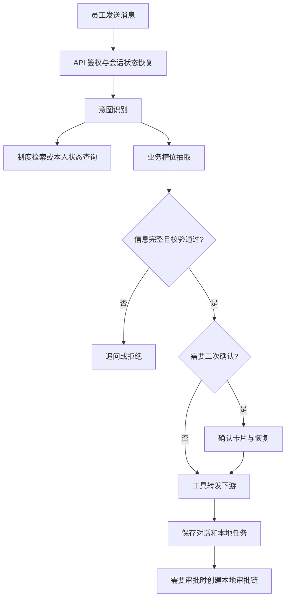

# 后端技术方案与代码地图

更新：2026-10-06。本文件按当前代码说明模块与数据流；未落地的目标列在 [开发计划](../planning/开发计划.md)，验证结果见 [当前状态](../guides/当前状态.md)。旧长篇方案与代码模板已 [归档](../archive/architecture/行政智能系统-技术方案设计参考.md)。

## 1. 项目边界

面向企业员工的行政助理，使用自然语言发起业务，通过规则、确认、工具转发与本地审批跟踪办理过程。实际下游目前为开发桩；系统不能仅凭聊天回复“已完成”证明真实业务已执行。

后端使用 FastAPI、SQLAlchemy 异步会话、PostgreSQL、Redis 和 Chroma；外部模型调用由 LLMGateway 封装。声明的 Celery/LangChain 等依赖并未全部接入业务。

## 2. 模块职责

| 模块 | 入口 | 当前职责 |
|---|---|---|
| 应用装配 | `app/admin_ai/main.py` | lifespan 初始化工具、网关、检索器、状态存储与编排器，注册路由和中间件 |
| API | `api/chat.py`、`task.py`、`auth.py`、`knowledge.py`、`admin.py` | 请求鉴权、Schema、数据库会话、任务/对话落库与响应 |
| 编排 | `core/agent/orchestrator.py` | 意图、补槽、规则、确认、调用工具；不持有请求级数据库会话 |
| 会话 | `core/agent/state_store.py` | Redis 状态存储及进程内回退，多轮待确认状态 |
| 规则 | `core/rules/engine.py` | 基础业务校验；余额与费用标准仍有示例配置 |
| 工具 | `core/tools/registry.py` 与各工具 | 注册、HTTP 转发、结果/受理编号；12 个注册键不等于 12 条可达业务 |
| 审批与组织 | `core/approval/` | 组织同步、规则条件、审批人路由、委派与数据归属 |
| 状态查询 | `core/status_query.py` | 本人单据及 HR 余额只读聚合，由 API 执行 |
| 模型边界 | `core/llm.py`、`llm_gateway.py`、`llm_redaction.py` | 构建客户端、拦截/脱敏/调用/回填/审计 |
| 知识检索 | `core/rag/retriever.py` | 文本切片、Chroma 同步调用的线程与超时包装 |
| 持久化 | `db/database.py`、`models.py`、`migrations/` | 会话工厂、10 张表、001～003 迁移 |
| 审计与日志 | `middleware/audit.py`、`logging.py` | 写操作审计和 TraceId；明文请求体保护需修复 |

`services/` 部分文件是未接入的骨架；修改主流程前先看 API 调用链，不要假定 service 类已被使用。

## 3. 数据模型与迁移

| 数据 | 表 |
|---|---|
| 员工与组织 | users、departments |
| 对话 | conversations、messages |
| 业务与审批 | tasks、approvals、approval_rules、approval_delegations |
| 审计与知识 | audit_logs、knowledge_docs |

模型是 `app/admin_ai/db/models.py`，不是文档里的代码副本。已有迁移：001 基础表，002 组织与审批路由，003 审批规则条件。不要用 create_all 代替迁移；时间与原生枚举约定见 [开发规范](../guides/开发规范.md#31-工程硬约定踩坑沉淀)。

## 4. 对话与办理流程

这是当前实现顺序。**工具调用在本地审批链创建之前**；下游接口到底建草稿、提交申请还是直接执行，必须由适配契约明确。真实执行要与审批通过/拒绝/取消形成一致的生命周期，当前尚未闭环。

## 5. 规则、确认与审批

- 规则校验决定输入能否继续；warnings 当前未完整消费。
- 报销、用印属于二次确认业务；用户确认不等于主管审批。
- `APPROVAL_REQUIRED_BUSINESS_TYPES` 决定哪些业务检查审批规则，与确认卡片分开。
- 审批人通过部门、金额、槽位条件、角色和委派计算，不取“首个管理员”。
- 规则缺失或审批人无法解析时转人工指派；配置了规则但当前不匹配可能无需审批。
- 规则条件、步骤模式与数据归属详见 [组织架构与审批路由设计](组织架构与审批路由设计.md)。

## 6. 模型与知识

新增外部调用必须经过 LLMGateway，带 purpose 与 session_key。占位符映射目前是进程内实现，多实例一致性需另行解决。涉密业务排除和特征拦截是局部控制，不能替代供应商承诺与整体数据治理。

Chroma 优先尝试服务模式，失败回退本地持久目录，再失败返回降级实例。当前未显式配置嵌入器，不能因为安装 sentence-transformers 就视为已使用该模型。问答输出是来源摘录模板；无命中、未索引、删除失败及模型切换需完善。

详细设计：[LLM 数据脱敏](LLM数据脱敏与合规设计.md)。

## 7. 组织与外部系统

HR HTTP / CSV 是组织数据来源，演示种子仅供开发。工具服务默认指向 OA 8001、财务 8002、物资 8003。真实接入需要约定身份、权限、参数白名单、受理编号、幂等、超时、重试和回调，不能仅修改 URL 就宣称联调成功。

状态查询与规则校验必须使用一致的 HR 余额口径，这是当前优先修复项。

## 8. API 与前端

接口实现见 `api/routes.py` 与各路由；契约见 [API 说明](../api/api-spec.md)。员工端通过 HTTP 请求，不依赖 WebSocket；确认接口以 conversation_id 定位会话待确认状态。

文件服务未实现；WebSocket 为回显桩；部分管理指标与工具配置接口是占位实现。管理后台 UI 只有 [独立方案](../frontend/管理后台前端技术方案设计.md)。

## 9. 安全与可观测性

已启用 JWT、部分角色/归属检查、写操作审计、TraceId 与生产配置校验。仍需修复 OAuth state 故障放行、审计明文、业务参数与重复确认问题。限流、WS 鉴权、哈希链、监控与自动化扫描未落地。

目标和边界见 [安全策略](../../SECURITY.md)，实际验收见开发计划。不要复制归档模板后便将控制项标为完成。

## 10. 修改时的检查入口

| 改动 | 同步检查 |
|---|---|
| 意图/槽位/规则 | 场景设计、编排测试、参数边界与模型回退 |
| 工具/真实系统接入 | HTTP 契约、下游鉴权、幂等及业务效果 |
| 审批/组织 | 规则条件、步序、归属、委派、组织同步与真实数据库测试 |
| API | Schema、前端调用、错误码、鉴权与接口文档 |
| 数据模型 | 迁移、兼容性、备份恢复与集成测试 |
| 模型/RAG | 数据边界、中文效果、无命中/超时与引用来源 |

开发命令见 [开发入门](../guides/开发入门.md)，测试命令见 [测试计划](../guides/测试计划.md)。
