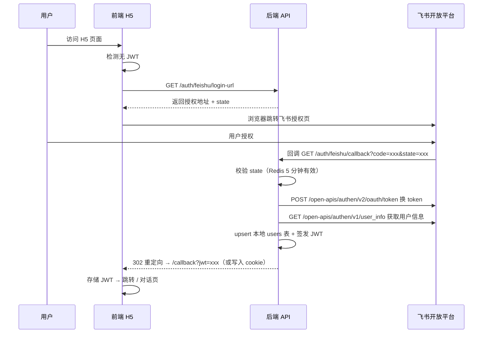

# 企业行政智能系统 - 前端技术方案设计

> 版本：V1.1　|　更新日期：2026-09-16　|　技术栈：React 18 + TypeScript + Vite + Semi Design
>
> 后端 API 文档：[api-spec.md](../api/api-spec.md)　|　技术方案：[技术方案设计](../architecture/行政智能系统-技术方案设计.md)

---

## 目录

1. [技术选型](#1-技术选型)
2. [项目结构](#2-项目结构)
3. [页面与路由设计](#3-页面与路由设计)
4. [核心模块设计](#4-核心模块设计)
5. [飞书 H5 集成](#5-飞书-h5-集成)
6. [状态管理](#6-状态管理)
7. [API 层设计](#7-api-层设计)
8. [样式与主题](#8-样式与主题)
9. [测试策略](#9-测试策略)
10. [构建与部署](#10-构建与部署)
11. [修订记录](#修订记录)

---

## 1. 技术选型

### 1.1 核心依赖

| 层级 | 选型 | 版本 | 理由 |
|------|------|------|------|
| 框架 | React | 18.3+ | 飞书组件库原生支持，生态成熟 |
| 语言 | TypeScript | 5.5+ | 类型安全，减少运行时错误 |
| 构建 | Vite | 5.x | 开发启动 <1s，HMR 极快 |
| UI 库 | Semi Design | 2.60+ | 字节出品，飞书视觉语言一致 |
| 状态管理 | Zustand | 4.5+ | 轻量（1KB），零 boilerplate |
| HTTP | Axios | 1.7+ | 拦截器、取消请求、错误处理 |
| 服务端状态 | TanStack Query | 5.x | 自动缓存/重试/轮询/乐观更新 |
| 路由 | React Router | 6.25+ | 标准方案，支持懒加载 |
| 包管理 | pnpm | 9.x | 快速、磁盘友好、严格依赖 |

### 1.2 开发工具链

| 工具 | 用途 |
|------|------|
| ESLint | 代码规范（@typescript-eslint + eslint-plugin-react） |
| Prettier | 代码格式化 |
| Husky + lint-staged | Git hooks，提交前自动检查 |
| Vitest | 单元测试（Vite 原生，快于 Jest） |
| @testing-library/react | 组件测试 |
| MSW (Mock Service Worker) | API Mock |

### 1.3 飞书 H5 专项依赖

飞书 JSAPI 通过 `index.html` 中 `<script>` 标签引入官方 H5 SDK（全局 `window.h5sdk` / `window.tt`），不通过 npm 安装。在 `src/types/feishu.d.ts` 中编写类型声明。

```json
{
  "@semi-bot/semi-theme-feishu": "^1.0.0"
}
```

- `@semi-bot/semi-theme-feishu`：Semi Design 飞书主题包，确保视觉一致

> **下迭代**：免登（`tt.requestAuthCode`）需后端新增免登专用接口（如 `/auth/feishu/jsapi-login`），当前后端不支持。

---

## 2. 项目结构

```text
frontend/
├── public/                          # 静态资源
│   ├── favicon.svg
│   └── index.html                   # 含飞书 H5 SDK script 标签
├── src/
│   ├── main.tsx                     # 入口
│   ├── App.tsx                      # 根组件 + 路由配置
│   ├── vite-env.d.ts                # Vite 类型声明
│   │
│   ├── api/                         # API 层
│   │   ├── client.ts                # Axios 实例 + 拦截器 + 信封解包
│   │   ├── auth.ts                  # 认证 API
│   │   ├── chat.ts                  # 对话 API
│   │   ├── task.ts                  # 任务 API
│   │   └── knowledge.ts             # 知识库 API
│   │
│   ├── stores/                      # Zustand 状态
│   │   ├── auth.ts                  # 认证状态（user, token）— Token 唯一真相源
│   │   ├── chat.ts                  # 对话状态（messages, conversation）
│   │   └── app.ts                   # 全局状态（theme, sidebar）
│   │
│   ├── hooks/                       # 自定义 Hooks
│   │   ├── useAuth.ts               # 认证逻辑
│   │   ├── useChat.ts               # 对话逻辑
│   │   └── useFeishu.ts             # 飞书环境检测 + OAuth 跳转
│   │
│   ├── pages/                       # 页面组件
│   │   ├── chat/                    # 对话页面
│   │   │   ├── index.tsx
│   │   │   ├── ChatInput.tsx
│   │   │   ├── MessageList.tsx
│   │   │   ├── MessageBubble.tsx
│   │   │   └── ConfirmCard.tsx
│   │   ├── tasks/                   # 我的任务
│   │   │   ├── index.tsx
│   │   │   ├── TaskList.tsx
│   │   │   └── TaskDetail.tsx
│   │   └── callback/                # 飞书 OAuth 回调
│   │       └── index.tsx
│   │
│   ├── components/                  # 通用组件
│   │   ├── Layout/                  # 布局
│   │   │   ├── index.tsx
│   │   │   └── TabBar.tsx
│   │   ├── Empty/                   # 空状态
│   │   ├── Loading/                 # 加载态
│   │   └── ErrorBoundary/           # 错误边界
│   │
│   ├── utils/                       # 工具函数
│   │   ├── token.ts                 # JWT 存取（统一读写 localStorage）
│   │   ├── format.ts                # 格式化
│   │   └── feishu.ts                # 飞书环境检测 + OAuth 跳转
│   │
│   └── types/                       # 类型定义
│       ├── api.ts                   # API 响应类型
│       ├── chat.ts                  # 对话相关类型
│       ├── task.ts                  # 任务相关类型
│       └── feishu.d.ts              # 飞书 H5 SDK 类型声明
│
├── .eslintrc.cjs
├── .prettierrc
├── tsconfig.json
├── vite.config.ts
├── package.json
└── pnpm-lock.yaml
```

---

## 3. 页面与路由设计

### 3.1 路由表

| 路径 | 页面 | 权限 | 说明 |
|------|------|------|------|
| `/` | 对话主页 | 登录 | 默认页面，飞书 H5 首页 |
| `/tasks` | 我的任务 | 登录 | 任务列表（我发起的 + 待我审批） |
| `/tasks/:id` | 任务详情 | 登录 | 任务详情 + 时间线（查看） |
| `/callback` | OAuth 回调 | 公开 | 飞书 OAuth 回调处理 |
| `*` | 404 | 公开 | 兜底路由，引导回对话页 |

### 3.2 页面流程

```
用户访问 H5
    ↓
检测是否有 JWT → 有 → 直接进入 /（对话页）
    ↓ 无
[OAuth 跳转] GET /auth/feishu/login-url → 浏览器跳转飞书授权页
    ↓
飞书回调 GET /auth/feishu/callback?code=xxx&state=xxx
    ↓
后端换 token + upsert + 签发 JWT → 前端 /callback 路由接住并存储 JWT
    ↓
跳转 /（对话页）
```

### 3.3 页面优先级

| 优先级 | 页面 | MVP 范围 |
|--------|------|----------|
| P0 | 对话主页 | ✅ 消息收发、确认卡片、转人工、会话历史恢复 |
| P0 | 飞书 OAuth 登录 | ✅ 授权跳转 + 回调 + JWT 存储（先落 token 再取用户信息） |
| P1 | 我的任务 | ✅ 列表 + 状态筛选（列表分页写死 50，待接分页） |
| P1 | 任务详情 | ✅ 详情 + 时间线 + 审批操作（同意/驳回）+ 属主取消 |
| P2 | 加签操作 | ⬜ 待下个迭代（后端 `/tasks/{id}/approve` 已支持 `add_sign`） |
| P2 | 审批工作台 | ⬜ 待下个迭代 |
| P2 | 管理后台 | ⬜ 待下个迭代（后端 `/admin/*` 接口已就绪） |

---

## 4. 核心模块设计

### 4.1 对话模块

**组件拆分：**

```
ChatPage
├── MessageList          # 消息列表（自动滚动）
│   └── MessageBubble    # 单条消息（区分用户/助手）
│       ├── TextContent  # 文本内容
│       └── ConfirmCard  # 确认卡片（高风险操作）
├── ChatInput            # 输入框 + 发送按钮
└── SuggestionChips      # 快捷回复建议
```

**交互流程：**

1. 用户输入消息 → `POST /chat/send` → 显示回复
2. 助手返回 `requires_action=true` → 渲染确认卡片（card_data 中包含 business_type 和 slots）
3. 用户确认/取消 → `POST /chat/confirm/{task_id}`
   > **注意**：task_id 依赖后端确认卡片返回 task_id 字段，当前后端 ChatResponse 的 card_data 中未提供 task_id，已列入后端待办
4. 助手返回 `transfer_to_human=true` → 显示转人工提示

> **下迭代**：WebSocket 实时对话（`ws://host/api/v1/chat/ws`），当前后端 WebSocket 为骨架，无消息协议实现。MVP 仅使用 HTTP POST `/chat/send` 轮询式交互。

### 4.2 任务模块

**后端 TaskStatus 枚举值：** `pending` / `approving` / `completed` / `failed` / `cancelled`

> 说明：驳回后任务状态为 `failed`，前端展示为"已失败（含驳回）"。

**列表页：**

- Tab 切换：`我发起的` | `待我审批`
- 状态筛选：全部 / 进行中（pending + approving）/ 已完成 / 已失败（含驳回）
- 卡片式列表，展示：标题、类型、状态、时间

**详情页：**

- 任务基本信息
- 审批链展示（步骤 + 状态）
- 时间线（创建 → 审批 → 完成）
- ~~操作按钮：同意 / 驳回 / 加签~~ → 下迭代，与审批工作台合并

---

## 5. 飞书 H5 集成

### 5.1 OAuth 授权码流程（MVP）



### 5.2 飞书 JSAPI 使用场景

| JSAPI | 场景 | MVP 状态 | 说明 |
|-------|------|----------|------|
| `tt.openLink` | 外链跳转 | ✅ 可用 | 在飞书内打开外部链接 |
| `tt.share` | 分享 | ✅ 可用 | 分享对话结果到聊天 |
| `tt.navigateTo` | 路由跳转 | ✅ 可用 | 飞书内页面跳转 |
| `tt.setClipboard` | 复制 | ✅ 可用 | 复制文本到剪贴板 |
| `tt.requestAuthCode` | 免登 | ⬜ 下迭代 | 需后端新增免登专用接口（如 `/auth/feishu/jsapi-login`），当前后端不支持 |

### 5.3 环境检测与登录路由

```typescript
// src/utils/feishu.ts

export function isFeishuEnv(): boolean {
  return /Lark|Feishu/i.test(navigator.userAgent);
}

/**
 * 飞书环境：跳转 OAuth 授权页
 * 非飞书环境（PC 浏览器）：同样走 OAuth 跳转流程
 * 开发环境：可用 /auth/dev-login 获取 JWT
 */
export async function redirectToLogin(): Promise<void> {
  const isDev = import.meta.env.DEV;

  if (isDev) {
    // 开发环境：直接调用 dev-login
    const res = await fetch(
      `${import.meta.env.VITE_API_BASE_URL}/auth/dev-login?employee_id=admin001`
    );
    const data = await res.json();
    if (data.code === 0) {
      useAuthStore.getState().login(data.data.access_token, { employee_id: "admin001" });
      window.location.href = "/";
    }
    return;
  }

  // 生产环境：获取飞书授权地址并跳转
  const res = await fetch(
    `${import.meta.env.VITE_API_BASE_URL}/auth/feishu/login-url`
  );
  const data = await res.json();
  if (data.code === 0) {
    window.location.href = data.data.login_url;
  }
}
```

> **飞书 H5 SDK 引入方式**：在 `public/index.html` 中添加：
> ```html
> <script src="https://lf1-cdn-tos.bytegoofy.com/goofy/lark/op/h5-js-sdk-1.5.31/h5-sdk.min.js"></script>
> ```
> 类型声明在 `src/types/feishu.d.ts` 中定义 `window.tt` 的类型。

---

## 6. 状态管理

### 6.1 Zustand Store 设计

Token 存取统一通过 `useAuthStore` 管理，拦截器从 store 读取 token（而非各自读 localStorage），保持单一数据源。

```typescript
// src/stores/auth.ts

import { create } from "zustand";
import { persist } from "zustand/middleware";

interface UserInfo {
  user_id: string;
  employee_id: string;
  role: string;
}

interface AuthState {
  user: UserInfo | null;
  token: string | null;
  isAuthenticated: boolean;
  login: (token: string, user: UserInfo) => void;
  logout: () => void;
  getToken: () => string | null;
}

export const useAuthStore = create<AuthState>()(
  persist(
    (set, get) => ({
      user: null,
      token: null,
      isAuthenticated: false,
      login: (token, user) => {
        set({ user, token, isAuthenticated: true });
      },
      logout: () => {
        set({ user: null, token: null, isAuthenticated: false });
      },
      getToken: () => get().token,
    }),
    { name: "auth-storage" } // localStorage key
  )
);
```

```typescript
// src/stores/chat.ts

import { create } from "zustand";

interface Message {
  id: string;
  role: "user" | "assistant";
  content: string;
  card_data?: Record<string, unknown>;
  requires_action?: boolean;
}

interface ChatState {
  conversationId: string | null;
  messages: Message[];
  isTyping: boolean;
  addMessage: (msg: Message) => void;
  setTyping: (typing: boolean) => void;
  clearMessages: () => void;
}

export const useChatStore = create<ChatState>((set) => ({
  conversationId: null,
  messages: [],
  isTyping: false,
  addMessage: (msg) => set((s) => ({ messages: [...s.messages, msg] })),
  setTyping: (typing) => set({ isTyping: typing }),
  clearMessages: () => set({ messages: [], conversationId: null }),
}));
```

### 6.2 状态分层

| 层级 | 工具 | 存储内容 |
|------|------|----------|
| 服务端状态 | TanStack Query | API 数据缓存（任务列表、用户信息） |
| 客户端状态 | Zustand | 认证、对话、UI 状态 |
| 持久化 | localStorage（Zustand persist） | JWT Token + 用户信息 |

---

## 7. API 层设计

### 7.1 Axios 实例

```typescript
// src/api/client.ts

import axios, { AxiosError, InternalAxiosRequestConfig } from "axios";
import { useAuthStore } from "@/stores/auth";

// 后端统一信封
interface ApiResponse<T = unknown> {
  code: number;
  message: string;
  data: T | null;
}

const client = axios.create({
  baseURL: import.meta.env.VITE_API_BASE_URL || "/api/v1",
  timeout: 30000,
});

// 请求拦截：从 Zustand store 读取 JWT
client.interceptors.request.use((config: InternalAxiosRequestConfig) => {
  const token = useAuthStore.getState().getToken();
  if (token) {
    config.headers.Authorization = `Bearer ${token}`;
  }
  return config;
});

// 401 失败计数器（防止 OAuth 跳转死循环）
let authFailCount = 0;
const MAX_AUTH_FAIL = 3;

// 响应拦截：统一解包 + 错误处理
client.interceptors.response.use(
  (response) => {
    const body: ApiResponse = response.data;

    // 业务错误：code !== 0
    if (body.code !== 0) {
      const error = new Error(body.message) as Error & { code: number };
      error.code = body.code;
      return Promise.reject(error);
    }

    // 解包：返回 data 字段给调用方
    return body.data;
  },
  (error: AxiosError) => {
    if (error.response?.status === 401) {
      authFailCount++;

      // 清除本地 token
      useAuthStore.getState().logout();

      if (authFailCount >= MAX_AUTH_FAIL) {
        // 连续失败 3 次，兜底提示
        alert("登录状态异常，请重新打开应用");
        authFailCount = 0;
      } else {
        // 触发重新走 OAuth 登录流程
        window.location.href = "/login"; // 由 /login 页面调用 redirectToLogin()
      }
    }
    return Promise.reject(error.response?.data || error);
  }
);

export default client;
export type { ApiResponse };
```

### 7.2 API 模块

```typescript
// src/api/auth.ts

import client from "./client";

export const authApi = {
  getLoginUrl: () => client.get("/auth/feishu/login-url") as Promise<{ login_url: string; state: string }>,
  devLogin: (employeeId: string) => client.get(`/auth/dev-login?employee_id=${employeeId}`) as Promise<{ access_token: string }>,
  getMe: () => client.get("/auth/me"),
};
```

```typescript
// src/api/chat.ts

import client from "./client";

interface ChatResponse {
  conversation_id: string;
  message_id: string;
  content: string;
  content_type: string;
  card_data: Record<string, unknown> | null;
  requires_action: boolean;
  tool_calls: unknown[];
}

export const chatApi = {
  sendMessage: (data: { message: string; conversation_id?: string }) =>
    client.post("/chat/send", data) as Promise<ChatResponse>,

  getHistory: (conversationId: string) =>
    client.get(`/chat/history/${conversationId}`),

  confirmAction: (taskId: string, confirmed: boolean) =>
    client.post(`/chat/confirm/${taskId}`, { confirmed }) as Promise<ChatResponse>,

  transferToHuman: (conversationId: string) =>
    client.post(`/chat/transfer/${conversationId}`) as Promise<ChatResponse>,
};
```

---

## 8. 样式与主题

### 8.1 飞书主题配置

Semi Design 主题通过 DSM（Design System Manager）自定义主题或在 `vite.config.ts` 中配置 less 变量覆盖实现。

```typescript
// vite.config.ts

import { defineConfig } from "vite";
import react from "@vitejs/plugin-react";
import semiDesign from "vite-plugin-semi-theme";

export default defineConfig({
  plugins: [react(), semiDesign()],
  css: {
    preprocessorOptions: {
      less: {
        modifyVars: {
          // 飞书主色覆盖
          "@semi-blue-6": "#3370ff",       // 飞书主色
          "@semi-green-6": "#34c724",      // 成功色
          "@semi-orange-6": "#ff7d00",     // 警告色
          "@semi-red-6": "#f53f3f",        // 危险色
        },
        javascriptEnabled: true,
      },
    },
  },
});
```

> **替代方案**：使用 Semi Design 的 [DSM 自定义主题工具](https://semi.design/dsm) 生成主题包，通过 `@import "~@semi-bot/semi-theme-feishu/semi-theme.less"` 引入。

### 8.2 布局方案

- **飞书 H5 容器**：飞书客户端提供原生标题栏，前端无需自定义 Header
- **底部 TabBar**：对话 | 任务（两个 Tab）
- **Safe Area**：适配刘海屏和底部手势区

```
┌─────────────────────┐
│   飞书原生标题栏     │  ← 飞书客户端提供
├─────────────────────┤
│                     │
│     页面内容区       │  ← 前端渲染
│                     │
│                     │
├─────────────────────┤
│   对话   │   任务    │  ← 底部 TabBar
└─────────────────────┘
```

---

## 9. 测试策略

### 9.1 测试层次

| 层级 | 工具 | 覆盖率目标 |
|------|------|-----------|
| 单元测试 | Vitest | Utils / Hooks ≥ 90% |
| 组件测试 | @testing-library/react | 关键组件 ≥ 80% |
| 集成测试 | Vitest + MSW | API 层 ≥ 70% |

### 9.2 关键测试用例

| 用例 | 类型 | 说明 |
|------|------|------|
| OAuth 登录流程 | 集成 | mock /auth/feishu/login-url → callback → JWT 存储 |
| 发送消息 | 组件 | 输入 → 发送 → 显示回复 |
| 确认卡片 | 组件 | 高风险操作确认/取消 |
| Token 过期 | 单元 | 401 → 清除 Token → 跳转 OAuth |
| 任务列表 | 组件 | 切换 Tab、状态筛选 |
| 信封解包 | 单元 | code !== 0 抛业务错误，code === 0 返回 data |

---

## 10. 构建与部署

### 10.1 环境变量

```bash
# .env.development
VITE_API_BASE_URL=http://localhost:8000/api/v1
VITE_FEISHU_APP_ID=your-dev-app-id

# .env.production
VITE_API_BASE_URL=https://api.example.com/api/v1
VITE_FEISHU_APP_ID=your-prod-app-id
```

### 10.2 构建命令

```bash
# 开发
pnpm dev

# 构建
pnpm build

# 预览构建产物
pnpm preview

# 测试
pnpm test

# Lint
pnpm lint
```

### 10.3 部署方案

```
飞书 H5 应用
    ↓
CDN 部署（静态资源）
    ↓
Nginx 反向代理
    ↓
后端 API（/api/v1/*）
```

- 前端静态资源部署到 CDN 或 Nginx
- 飞书工作台配置 H5 应用入口 URL
- API 请求通过 Nginx 反向代理到后端

---

## 附录：与后端接口对齐

| 前端模块 | 后端接口 | 方法 | MVP 状态 |
|----------|----------|------|----------|
| OAuth 跳转地址 | `/auth/feishu/login-url` | GET | ✅ |
| OAuth 回调 | `/auth/feishu/callback` | GET | ✅ |
| 开发登录 | `/auth/dev-login` | GET | ✅（仅 development） |
| 当前用户 | `/auth/me` | GET | ✅ |
| 发送消息 | `/chat/send` | POST | ✅ |
| 会话历史 | `/chat/history/{id}` | GET | ✅ |
| 确认操作 | `/chat/confirm/{id}` | POST | ✅（task_id 待后端补充） |
| 转人工 | `/chat/transfer/{id}` | POST | ✅ |
| 我的任务 | `/tasks/my` | GET | ✅ |
| 待审批 | `/tasks/pending-approval` | GET | ✅ |
| 任务详情 | `/tasks/{id}` | GET | ✅ |
| 取消任务 | `/tasks/{id}/cancel` | POST | ✅ |
| 时间线 | `/tasks/{id}/timeline` | GET | ✅ |
| 审批操作 | `/tasks/{id}/approve` | POST | ✅（同意/驳回；加签待前端接入） |
| WebSocket | `/chat/ws` | WS | ⬜ 下迭代（后端为 echo 骨架，无鉴权） |

---

## 修订记录

| 版本 | 日期 | 变更内容 |
|------|------|----------|
| V1.0 | 2026-09-16 | 初始版本 |
| V1.1 | 2026-09-16 | 登录方案改为 OAuth 跳转、修正伪造依赖（删除 @anthropic/feishu-sdk）、MVP 范围收口（WebSocket/审批操作移出 MVP）、对齐后端 TaskStatus 枚举与接口、401 处理改为 OAuth 重登录、统一信封解包、Token 读取统一为 Zustand store |