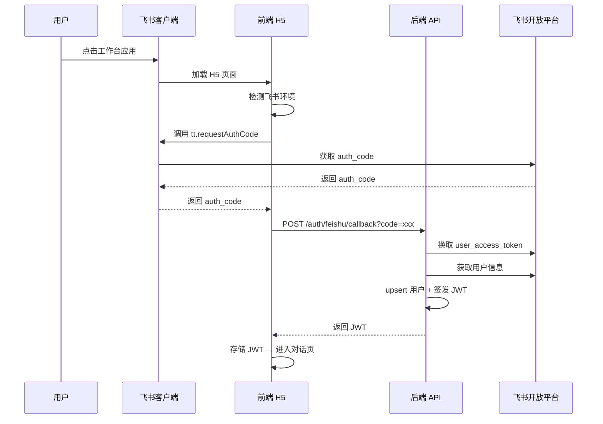

# 企业行政智能系统 - 前端技术方案设计

> 版本：V1.0　|　更新日期：2026-09-16　|　技术栈：React 18 + TypeScript + Vite + Semi Design
>
> 后端 API 文档：[api-spec.md](../api/api-spec.md)　|　技术方案：[技术方案设计](../architecture/行政智能系统-技术方案设计.md)

---

## 目录

1. [技术选型](#1-技术选型)
2. [项目结构](#2-项目结构)
3. [页面与路由设计](#3-页面与路由设计)
4. [核心模块设计](#4-核心模块设计)
5. [飞书 H5 集成](#5-飞书-h5-集成)
6. [状态管理](#6-状态管理)
7. [API 层设计](#7-api-层设计)
8. [样式与主题](#8-样式与主题)
9. [测试策略](#9-测试策略)
10. [构建与部署](#10-构建与部署)

---

## 1. 技术选型

### 1.1 核心依赖

| 层级 | 选型 | 版本 | 理由 |
|------|------|------|------|
| 框架 | React | 18.3+ | 飞书组件库原生支持，生态成熟 |
| 语言 | TypeScript | 5.5+ | 类型安全，减少运行时错误 |
| 构建 | Vite | 5.x | 开发启动 <1s，HMR 极快 |
| UI 库 | Semi Design | 2.60+ | 字节出品，飞书视觉语言一致 |
| 状态管理 | Zustand | 4.5+ | 轻量（1KB），零 boilerplate |
| HTTP | Axios | 1.7+ | 拦截器、取消请求、错误处理 |
| 服务端状态 | TanStack Query | 5.x | 自动缓存/重试/轮询/乐观更新 |
| 路由 | React Router | 6.25+ | 标准方案，支持懒加载 |
| 飞书 SDK | @anthropic/feishu-sdk | 最新 | JSAPI 调用（免登、路由、分享） |
| 包管理 | pnpm | 9.x | 快速、磁盘友好、严格依赖 |

### 1.2 开发工具链

| 工具 | 用途 |
|------|------|
| ESLint | 代码规范（@typescript-eslint + eslint-plugin-react） |
| Prettier | 代码格式化 |
| Husky + lint-staged | Git hooks，提交前自动检查 |
| Vitest | 单元测试（Vite 原生，快于 Jest） |
| @testing-library/react | 组件测试 |
| MSW (Mock Service Worker) | API Mock |

### 1.3 飞书 H5 专项依赖

```json
{
  "@anthropic/feishu-sdk": "^1.0.0",
  "@semi-bot/semi-theme-feishu": "^1.0.0"
}
```

- `@anthropic/feishu-sdk`：调用飞书 JSAPI（免登鉴权、路由跳转、分享、审批卡片）
- `@semi-bot/semi-theme-feishu`：Semi Design 飞书主题包，确保视觉一致

---

## 2. 项目结构

```text
frontend/
├── public/                          # 静态资源
│   └── favicon.svg
├── src/
│   ├── main.tsx                     # 入口
│   ├── App.tsx                      # 根组件 + 路由配置
│   ├── vite-env.d.ts                # Vite 类型声明
│   │
│   ├── api/                         # API 层
│   │   ├── client.ts                # Axios 实例 + 拦截器
│   │   ├── auth.ts                  # 认证 API
│   │   ├── chat.ts                  # 对话 API
│   │   ├── task.ts                  # 任务 API
│   │   └── knowledge.ts             # 知识库 API
│   │
│   ├── stores/                      # Zustand 状态
│   │   ├── auth.ts                  # 认证状态（user, token）
│   │   ├── chat.ts                  # 对话状态（messages, conversation）
│   │   └── app.ts                   # 全局状态（theme, sidebar）
│   │
│   ├── hooks/                       # 自定义 Hooks
│   │   ├── useAuth.ts               # 认证逻辑
│   │   ├── useChat.ts               # 对话逻辑
│   │   └── useFeishu.ts             # 飞书 JSAPI 封装
│   │
│   ├── pages/                       # 页面组件
│   │   ├── chat/                    # 对话页面
│   │   │   ├── index.tsx
│   │   │   ├── ChatInput.tsx
│   │   │   ├── MessageList.tsx
│   │   │   ├── MessageBubble.tsx
│   │   │   └── ConfirmCard.tsx
│   │   ├── tasks/                   # 我的任务
│   │   │   ├── index.tsx
│   │   │   ├── TaskList.tsx
│   │   │   └── TaskDetail.tsx
│   │   ├── approval/                # 审批工作台
│   │   │   ├── index.tsx
│   │   │   └── ApprovalCard.tsx
│   │   └── callback/                # 飞书 OAuth 回调
│   │       └── index.tsx
│   │
│   ├── components/                  # 通用组件
│   │   ├── Layout/                  # 布局
│   │   │   ├── index.tsx
│   │   │   ├── Header.tsx
│   │   │   └── TabBar.tsx
│   │   ├── Empty/                   # 空状态
│   │   ├── Loading/                 # 加载态
│   │   └── ErrorBoundary/           # 错误边界
│   │
│   ├── utils/                       # 工具函数
│   │   ├── token.ts                 # JWT 存取
│   │   ├── format.ts                # 格式化
│   │   └── feishu.ts                # 飞书环境检测
│   │
│   └── types/                       # 类型定义
│       ├── api.ts                   # API 响应类型
│       ├── chat.ts                  # 对话相关类型
│       └── task.ts                  # 任务相关类型
│
├── .eslintrc.cjs
├── .prettierrc
├── tsconfig.json
├── vite.config.ts
├── package.json
└── pnpm-lock.yaml
```

---

## 3. 页面与路由设计

### 3.1 路由表

| 路径 | 页面 | 权限 | 说明 |
|------|------|------|------|
| `/` | 对话主页 | 登录 | 默认页面，飞书 H5 首页 |
| `/tasks` | 我的任务 | 登录 | 任务列表（我发起的 + 待我审批） |
| `/tasks/:id` | 任务详情 | 登录 | 任务详情 + 时间线 + 审批操作 |
| `/callback` | OAuth 回调 | 公开 | 飞书 OAuth 回调处理 |

### 3.2 页面流程

```
飞书工作台点击应用
    ↓
[免登鉴权] → 已有 JWT → 直接进入 /（对话页）
    ↓ 首次访问
[OAuth 授权] → /callback → 签发 JWT → 跳转 /
    ↓
[对话页] ←→ [任务页]
    ↓
[任务详情] → [审批操作]
```

### 3.3 页面优先级

| 优先级 | 页面 | MVP 范围 |
|--------|------|----------|
| P0 | 对话主页 | ✅ 消息收发、确认卡片、转人工 |
| P0 | 飞书免登 | ✅ OAuth + JWT 自动签发 |
| P1 | 我的任务 | ✅ 列表 + 状态筛选 |
| P1 | 任务详情 | ✅ 详情 + 时间线 + 审批 |
| P2 | 审批工作台 | ⬜ 待下个迭代 |
| P2 | 管理后台 | ⬜ 待下个迭代 |

---

## 4. 核心模块设计

### 4.1 对话模块

**组件拆分：**

```
ChatPage
├── MessageList          # 消息列表（自动滚动）
│   └── MessageBubble    # 单条消息（区分用户/助手）
│       ├── TextContent  # 文本内容
│       └── ConfirmCard  # 确认卡片（高风险操作）
├── ChatInput            # 输入框 + 发送按钮
└── SuggestionChips      # 快捷回复建议
```

**交互流程：**

1. 用户输入消息 → `POST /chat/send` → 流式显示回复
2. 助手返回 `requires_action=true` → 渲染确认卡片
3. 用户确认/取消 → `POST /chat/confirm/{task_id}`
4. 助手返回 `transfer_to_human=true` → 显示转人工提示

**WebSocket 实时对话：**

- 连接 `ws://host/api/v1/chat/ws`
- 消息格式：`{ type: "message" | "typing" | "error", data: ... }`
- 断线自动重连（指数退避）

### 4.2 任务模块

**列表页：**

- Tab 切换：`我发起的` | `待我审批`
- 状态筛选：全部 / 进行中 / 已完成 / 已拒绝
- 卡片式列表，展示：标题、类型、状态、时间

**详情页：**

- 任务基本信息
- 审批链展示（步骤 + 状态）
- 时间线（创建 → 审批 → 完成）
- 操作按钮：同意 / 驳回 / 加签

---

## 5. 飞书 H5 集成

### 5.1 免登流程



### 5.2 飞书 JSAPI 使用场景

| JSAPI | 场景 | 说明 |
|-------|------|------|
| `tt.requestAuthCode` | 免登 | 获取授权码 |
| `tt.openLink` | 外链跳转 | 在飞书内打开外部链接 |
| `tt.share` | 分享 | 分享对话结果到聊天 |
| `tt.navigateTo` | 路由跳转 | 飞书内页面跳转 |
| `tt.setClipboard` | 复制 | 复制文本到剪贴板 |

### 5.3 环境检测

```typescript
// src/utils/feishu.ts

export function isFeishuEnv(): boolean {
  return /Lark|Feishu/i.test(navigator.userAgent);
}

export function getFeishuAuthCode(): Promise<string> {
  return new Promise((resolve, reject) => {
    if (!isFeishuEnv()) {
      reject(new Error("非飞书环境"));
      return;
    }
    // @ts-ignore
    window.tt.requestAuthCode({
      appId: import.meta.env.VITE_FEISHU_APP_ID,
      success: (res: { code: string }) => resolve(res.code),
      fail: (err: any) => reject(err),
    });
  });
}
```

---

## 6. 状态管理

### 6.1 Zustand Store 设计

```typescript
// src/stores/auth.ts

interface AuthState {
  user: UserInfo | null;
  token: string | null;
  isAuthenticated: boolean;
  login: (token: string, user: UserInfo) => void;
  logout: () => void;
}

export const useAuthStore = create<AuthState>((set) => ({
  user: null,
  token: localStorage.getItem("token"),
  isAuthenticated: !!localStorage.getItem("token"),
  login: (token, user) => {
    localStorage.setItem("token", token);
    set({ user, token, isAuthenticated: true });
  },
  logout: () => {
    localStorage.removeItem("token");
    set({ user: null, token: null, isAuthenticated: false });
  },
}));
```

```typescript
// src/stores/chat.ts

interface ChatState {
  conversationId: string | null;
  messages: Message[];
  isTyping: boolean;
  addMessage: (msg: Message) => void;
  setTyping: (typing: boolean) => void;
  clearMessages: () => void;
}

export const useChatStore = create<ChatState>((set) => ({
  conversationId: null,
  messages: [],
  isTyping: false,
  addMessage: (msg) => set((s) => ({ messages: [...s.messages, msg] })),
  setTyping: (typing) => set({ isTyping: typing }),
  clearMessages: () => set({ messages: [], conversationId: null }),
}));
```

### 6.2 状态分层

| 层级 | 工具 | 存储内容 |
|------|------|----------|
| 服务端状态 | TanStack Query | API 数据缓存（任务列表、用户信息） |
| 客户端状态 | Zustand | 认证、对话、UI 状态 |
| 持久化 | localStorage | JWT Token |

---

## 7. API 层设计

### 7.1 Axios 实例

```typescript
// src/api/client.ts

import axios from "axios";

const client = axios.create({
  baseURL: import.meta.env.VITE_API_BASE_URL || "/api/v1",
  timeout: 30000,
});

// 请求拦截：注入 JWT
client.interceptors.request.use((config) => {
  const token = localStorage.getItem("token");
  if (token) {
    config.headers.Authorization = `Bearer ${token}`;
  }
  return config;
});

// 响应拦截：统一错误处理
client.interceptors.response.use(
  (response) => response.data,
  (error) => {
    if (error.response?.status === 401) {
      // Token 过期，触发重新登录
      localStorage.removeItem("token");
      window.location.href = "/";
    }
    return Promise.reject(error.response?.data || error);
  }
);

export default client;
```

### 7.2 API 模块

```typescript
// src/api/chat.ts

import client from "./client";

export const chatApi = {
  sendMessage: (data: { message: string; conversation_id?: string }) =>
    client.post("/chat/send", data),

  getHistory: (conversationId: string) =>
    client.get(`/chat/history/${conversationId}`),

  confirmAction: (taskId: string, confirmed: boolean) =>
    client.post(`/chat/confirm/${taskId}`, { confirmed }),

  transferToHuman: (conversationId: string) =>
    client.post(`/chat/transfer/${conversationId}`),
};
```

---

## 8. 样式与主题

### 8.1 飞书主题配置

```typescript
// src/theme/index.ts

import { Semi Design } from "@semi-bot/semi-theme-feishu";

export const theme = {
  ...Semi Design,
  // 自定义覆盖
  colors: {
    primary: "#3370ff",      // 飞书主色
    success: "#34c724",
    warning: "#ff7d00",
    danger: "#f53f3f",
  },
};
```

### 8.2 布局方案

- **飞书 H5 容器**：飞书客户端提供原生标题栏，前端无需自定义 Header
- **底部 TabBar**：对话 | 任务（两个 Tab）
- **Safe Area**：适配刘海屏和底部手势区

```
┌─────────────────────┐
│   飞书原生标题栏     │  ← 飞书客户端提供
├─────────────────────┤
│                     │
│     页面内容区       │  ← 前端渲染
│                     │
│                     │
├─────────────────────┤
│   对话   │   任务    │  ← 底部 TabBar
└─────────────────────┘
```

---

## 9. 测试策略

### 9.1 测试层次

| 层级 | 工具 | 覆盖率目标 |
|------|------|-----------|
| 单元测试 | Vitest | Utils / Hooks ≥ 90% |
| 组件测试 | @testing-library/react | 关键组件 ≥ 80% |
| 集成测试 | Vitest + MSW | API 层 ≥ 70% |

### 9.2 关键测试用例

| 用例 | 类型 | 说明 |
|------|------|------|
| 免登流程 | 集成 | mock 飞书 SDK → callback → JWT |
| 发送消息 | 组件 | 输入 → 发送 → 显示回复 |
| 确认卡片 | 组件 | 高风险操作确认/取消 |
| Token 过期 | 单元 | 401 → 清除 Token → 跳转登录 |
| 任务列表 | 组件 | 切换 Tab、状态筛选 |

---

## 10. 构建与部署

### 10.1 环境变量

```bash
# .env.development
VITE_API_BASE_URL=http://localhost:8000/api/v1
VITE_FEISHU_APP_ID=your-dev-app-id

# .env.production
VITE_API_BASE_URL=https://api.example.com/api/v1
VITE_FEISHU_APP_ID=your-prod-app-id
```

### 10.2 构建命令

```bash
# 开发
pnpm dev

# 构建
pnpm build

# 预览构建产物
pnpm preview

# 测试
pnpm test

# Lint
pnpm lint
```

### 10.3 部署方案

```
飞书 H5 应用
    ↓
CDN 部署（静态资源）
    ↓
Nginx 反向代理
    ↓
后端 API（/api/v1/*）
```

- 前端静态资源部署到 CDN 或 Nginx
- 飞书工作台配置 H5 应用入口 URL
- API 请求通过 Nginx 反向代理到后端

---

## 附录：与后端接口对齐

| 前端模块 | 后端接口 | 方法 |
|----------|----------|------|
| 免登 | `/auth/feishu/callback` | GET |
| 开发登录 | `/auth/dev-login` | GET |
| 当前用户 | `/auth/me` | GET |
| 发送消息 | `/chat/send` | POST |
| 会话历史 | `/chat/history/{id}` | GET |
| 确认操作 | `/chat/confirm/{id}` | POST |
| 转人工 | `/chat/transfer/{id}` | POST |
| 我的任务 | `/tasks/my` | GET |
| 待审批 | `/tasks/pending-approval` | GET |
| 任务详情 | `/tasks/{id}` | GET |
| 审批 | `/tasks/{id}/approve` | POST |
| 取消任务 | `/tasks/{id}/cancel` | POST |
| 时间线 | `/tasks/{id}/timeline` | GET |