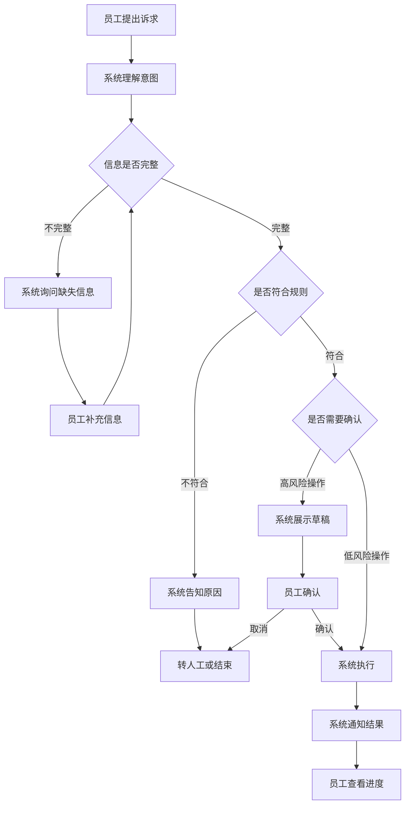
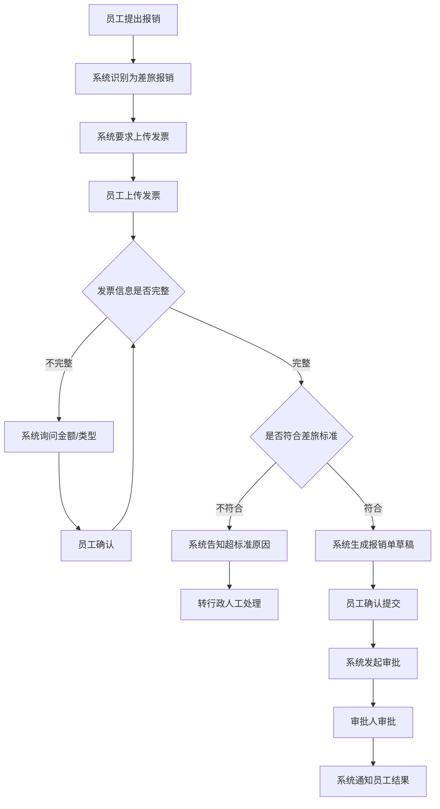
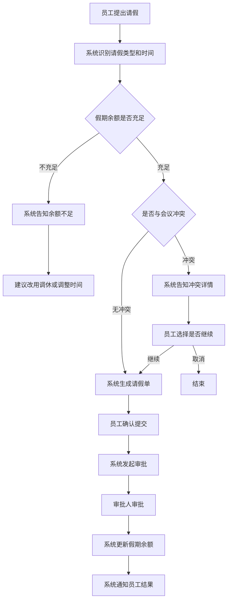
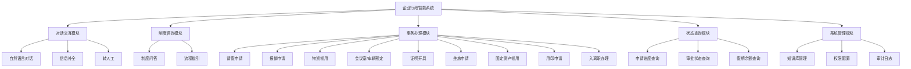

# 企业行政智能系统 需求文档

> **文档定位（2026-10-06）**：本文件描述产品/场景/架构设计，包含目标能力与示例，不作为当前实现或上线验收证明。实现及验证范围以 [当前状态](../guides/当前状态.md) 为准，后续任务以 [开发计划](../planning/开发计划.md) 为准。原有版本和修订记录用于追溯。

> 版本：V1.3　|　更新日期：2026-09-16　|　文档类型：产品需求文档（PRD）
>
> ℹ️ 本文档描述**产品需求**（应然），不反映实现进度。**当前实现状态与待办清单**
> 见 [项目当前状况与交接说明](../guides/当前状态.md)。

---

## 目录

1. [产品概述](#1-产品概述)
2. [范围与边界](#2-范围与边界)
3. [用户角色](#3-用户角色)
4. [用户业务流程](#4-用户业务流程)
5. [功能模块与功能点](#5-功能模块与功能点)
6. [非功能要求与验收要求](#6-非功能要求与验收要求)
7. [系统限制与风险](#7-系统限制与风险)
8. [演进路线](#8-演进路线)

---

## 1. 产品概述

### 1.1 目标用户

企业内部全体员工、部门主管、行政专员、财务/HR 人员、系统管理员。

### 1.2 产品用途

员工通过自然语言提出行政诉求，系统自动理解意图并完成事务办理，包括：制度咨询、资源预定、请假报销、物资领用、证明开具等高频行政事务。

### 1.3 核心价值

| 价值 | 说明 |
|------|------|
| 提效 | 高频事务自助办理，员工无需反复询问行政人员 |
| 规范 | 统一制度口径，避免"每个人答案不一样" |
| 透明 | 全流程状态可查、进度可推送，降低催办成本 |
| 可审计 | 每次操作全程留痕，满足合规要求 |

### 1.4 痛点与解决方式

| 痛点 | 现状 | 系统解决方式 |
|------|------|--------------|
| 重复咨询 | 同类问题被反复询问 | 统一知识库即时回答 |
| 流程繁琐 | 多环节串联，员工无从下手 | 一句话发起，系统自动串联 |
| 规则分散 | 制度散落各处 | 统一入口查询 |
| 信息不对称 | 不知道办到哪了 | 实时状态查询与推送 |
| 人力错配 | 行政忙于机械事务 | 自动化释放人力 |

---

## 2. 范围与边界

### 2.1 系统提供的能力

| 能力类别 | 具体内容 |
|----------|----------|
| 制度咨询 | 回答年假天数、报销标准、请假流程等高频问题 |
| 事务办理 | 请假、报销、物资领用、会议室预定等行政事务 |
| 状态查询 | 查询申请进度、审批状态、办理结果 |
| 异常兜底 | 无法自动处理时转人工或创建工单 |

### 2.2 前置条件

- 员工需通过飞书授权登录系统
- 系统需对接现有 OA、审批流、物资库等外部系统
- **需提供组织架构数据**：部门树与汇报关系（主管/总监）须可从 HR 或 OA 系统获取或导入，
  否则审批无法路由到正确审批人（详见 §3 说明与 [组织架构与审批路由设计](../architecture/组织架构与审批路由设计.md)）
- 制度知识库需提前录入并保持更新，且需指定**维护责任人、更新触发条件与审核流程**（详见 §5.6 说明）
- **需与 LLM 供应商签署数据处理协议**，明确「不用于训练、留存期限、可删除」三项
  （详见 §6.4 安全要求与 [LLM 数据脱敏与合规设计](../architecture/LLM数据脱敏与合规设计.md)）

### 2.3 不在范围内

- 涉及资金支付、合同签署等高风险操作：系统生成草稿，人工确认后执行
- 超出行政范畴的开放式诉求（如战略咨询）：系统明确告知并引导至相关部门
- 无接口、无数据的系统对接：系统告知限制并提供替代方案

---

## 3. 用户角色

| 角色 | 核心诉求 | 可执行操作 |
|------|----------|------------|
| 普通员工 | 快速办理行政事务 | 发起咨询/申请、查看进度、上传附件 |
| 部门主管 | 审批下属申请 | 接收审批任务、同意/驳回/加签 |
| 行政专员 | 处理例外事务 | 处理转人工工单、维护制度知识库 |
| 财务/HR | 审核专业单据 | 对报销、人事事项做专业复核 |
| 系统管理员 | 管理系统配置 | 配置工具、权限、规则参数、查看审计日志 |

### 3.1 角色与组织架构的关系（2026-09-20 补充）

上表中的「部门主管」「财务/HR」不是独立设置的角色标签，而是**由组织架构推导出的审批关系**：

| 要求 | 说明 |
|------|------|
| 部门树 | 系统需维护父子部门结构（建议 2~3 层，如 公司 → 部门 → 组） |
| 汇报关系 | 每个部门需指定负责人（主管）；上级部门负责人即「总监」层 |
| 数据来源 | 优先从 HR/OA 系统同步，**不在本系统重复维护**（避免两套真相） |
| 数据归属 | 员工仅可见本人单据；主管可见本部门及所有子部门的单据；财务/HR 按业务类型可见全量（受审计） |
| 审批路由 | 按「业务类型 + 金额 + 申请人部门」自动计算审批链，规则可配置（见 §5.4 事务办理的审批规则） |
| 兜底原则 | 无法解析出审批人时**转人工指派**，不得猜测（错误路由会使审批失去授权效力） |

> 详细数据模型与路由算法见 [组织架构与审批路由设计](../architecture/组织架构与审批路由设计.md)。

---

## 4. 用户业务流程

### 4.1 通用办事流程

员工办理行政事务的通用流程如下：

**流程说明：**

| 步骤 | 员工动作 | 系统响应 |
|------|----------|----------|
| 提出诉求 | 用自然语言描述需求 | 理解意图，识别办理类型 |
| 补充信息 | 根据提示提供必要信息 | 校验信息完整性 |
| 规则校验 | 无需操作 | 检查是否符合制度和权限 |
| 确认操作 | 查看草稿并确认 | 高风险操作需人工确认 |
| 执行办理 | 无需操作 | 调用相关系统完成办理 |
| 结果通知 | 查看通知 | 推送办理结果和进度 |

### 4.2 报销办事流程

### 4.3 请假办事流程

---

## 5. 功能模块与功能点

### 5.1 功能模块总览

### 5.2 对话交互模块

| 功能点 | 功能描述 | 输入 | 输出 |
|--------|----------|------|------|
| 自然语言对话 | 员工用日常语言描述需求，系统理解意图并响应 | 员工输入的文字消息 | 系统的回复内容或操作引导 |
| 信息补全 | 办理事务所需信息不完整时，系统逐项询问 | 系统提出的问题 | 员工补充的信息 |
| 转人工 | 系统无法处理时，将对话转给人工客服 | 员工确认转人工 | 转接成功提示和工单号 |

### 5.3 制度咨询模块

| 功能点 | 功能描述 | 输入 | 输出 |
|--------|----------|------|------|
| 制度问答 | 回答关于年假、报销标准、请假流程等制度问题 | 员工的制度相关问题 | 制度内容及来源引用 |
| 流程指引 | 说明某类事务的办理步骤和所需材料 | 员工询问如何办理某事 | 办理步骤、所需材料清单 |

### 5.4 事务办理模块

#### 5.4.1 请假申请

| 功能点 | 功能描述 | 输入 | 输出 |
|--------|----------|------|------|
| 发起请假 | 员工通过对话发起请假申请 | 请假类型、开始时间、结束时间 | 请假单草稿 |
| 余额校验 | 系统检查假期余额是否充足 | 请假类型和天数 | 余额是否充足的结果 |
| 冲突检测 | 系统检查是否与会议或项目冲突 | 请假时间段 | 冲突详情或无冲突结果 |
| 发起审批 | 确认后自动发起审批流程 | 员工确认提交 | 审批单号和预计审批时间 |

#### 5.4.2 报销申请

| 功能点 | 功能描述 | 输入 | 输出 |
|--------|----------|------|------|
| 发起报销 | 员工通过对话发起报销申请 | 报销类型、关联出差单 | 报销引导 |
| 发票上传 | 上传发票附件 | 发票图片或PDF | 发票识别结果 |
| 标准校验 | 系统检查是否符合差旅标准 | 发票金额、报销类型 | 是否符合标准的结果 |
| 人工确认 | 高风险操作需员工确认 | 报销单草稿 | 确认或取消 |

#### 5.4.3 物资领用

| 功能点 | 功能描述 | 输入 | 输出 |
|--------|----------|------|------|
| 发起领用 | 员工申请领用办公物资 | 物资名称、数量 | 库存查询结果 |
| 库存检查 | 系统检查库存是否充足 | 物资名称和数量 | 库存状态 |
| 领用确认 | 确认领用信息 | 员工确认 | 领用单号 |

#### 5.4.4 会议室/车辆预定

| 功能点 | 功能描述 | 输入 | 输出 |
|--------|----------|------|------|
| 会议室预定 | 预定指定时间段的会议室 | 日期、时间、人数、设备需求 | 可用会议室列表和预定结果 |
| 车辆预定 | 预定公务用车 | 日期、时间、目的地、人数 | 可用车辆和预定结果 |

#### 5.4.5 证明开具

| 功能点 | 功能描述 | 输入 | 输出 |
|--------|----------|------|------|
| 在职证明 | 申请开具在职证明 | 用途说明 | 证明文件预览和下载 |
| 收入证明 | 申请开具收入证明 | 用途说明 | 证明文件预览和下载 |

#### 5.4.6 差旅申请

| 功能点 | 功能描述 | 输入 | 输出 |
|--------|----------|------|------|
| 发起差旅 | 申请出差并预订交通住宿 | 目的地、时间、事由 | 差旅单草稿和行程建议 |
| 行程预订 | 按标准预订机票/酒店 | 确认行程 | 预订确认信息 |

#### 5.4.7 固定资产领用

| 功能点 | 功能描述 | 输入 | 输出 |
|--------|----------|------|------|
| 资产领用 | 申请领用固定资产 | 资产类型、数量 | 可用资产查询结果 |
| 资产归还 | 申请归还已领用资产 | 资产编号 | 归还确认 |

#### 5.4.8 用印申请

| 功能点 | 功能描述 | 输入 | 输出 |
|--------|----------|------|------|
| 发起用印 | 申请使用公章/合同章 | 文件名称、用印类型、份数 | 用印申请单草稿 |
| 人工确认 | 用印操作需人工确认 | 用印申请详情 | 确认后发起审批 |

#### 5.4.9 入离职办理

| 功能点 | 功能描述 | 输入 | 输出 |
|--------|----------|------|------|
| 入职引导 | 引导新员工完成入职手续 | 员工信息 | 待办事项清单和办理指引 |
| 离职引导 | 引导离职员工完成交接 | 离职申请 | 交接事项清单和办理指引 |

### 5.5 状态查询模块

| 功能点 | 功能描述 | 输入 | 输出 |
|--------|----------|------|------|
| 申请进度查询 | 查询某项申请的当前状态 | 申请单号或描述 | 当前状态、审批节点、预计完成时间 |
| 审批状态查询 | 查询待审批或已审批的列表 | 无 | 待办审批列表和历史审批记录 |
| 假期余额查询 | 查询各类假期的剩余天数 | 假期类型 | 当前可用余额 |

### 5.6 系统管理模块

| 功能点 | 功能描述 | 输入 | 输出 |
|--------|----------|------|------|
| 知识库管理 | 上传、编辑、删除制度文档 | 文档内容或文件 | 操作结果 |
| 权限配置 | 配置角色和功能权限 | 角色、权限范围 | 配置结果 |
| **审批规则配置** | 按业务类型与金额区间配置审批链（如 ≤2000 元主管审批、>2000 元总监→主管） | 业务类型、金额区间、审批人类型 | 规则清单 |
| **组织架构查看** | 查看部门树、部门负责人、汇报关系（数据源自 HR/OA 同步） | 查询条件 | 部门与负责人列表 |
| 审计日志 | 查看系统操作记录 | 查询条件 | 操作记录列表 |

> **首期交付方式（2026-09-20 决策 D-5 / 评审 I-3）**：本节功能的**首期实现不含管理后台 UI**——
> 审批规则与组织架构通过脚本与接口维护（`/admin/approval-rules`、`/admin/departments`、
> `/admin/org/sync` 与 `scripts/manage_approval_rules.py`、`scripts/sync_org.py`），
> 知识库通过 `/knowledge/*` 接口维护；管理后台前端页面与其余功能项的上线归属待评审 I-3 决策后另排期。

**知识库运营要求（2026-09-20 补充）**：制度知识库是「活」的，需明确：

| 项 | 要求 |
|----|------|
| 维护责任人 | 指定行政专员为责任人（建议至少 2 人互为备份） |
| 更新触发 | 制度发文后 N 个工作日内完成录入（N 由公司确定，建议 ≤3） |
| 审核流程 | 发布前需双人复核（制度类内容错误会被员工当作依据，风险高于"答不出来"） |
| 有效期管理 | 文档需标注生效/失效日期，到期自动提醒责任人确认 |
| 效果度量 | 需可查看知识库命中率与未命中问题清单，用于发现内容缺口 |

**首期范围说明（2026-09-20，待产品确认）**：本模块的**管理界面**是否随首期上线，影响行政专员能否自助维护。
若首期不做界面，需明确过渡操作方式（如由技术人员执行导入脚本），否则知识库将无法及时更新而逐渐失效。

---

## 6. 非功能要求与验收要求

### 6.1 性能要求

**规模基线（200 人企业，2026-09-20 补充）**：日活员工 200 人，人均 3 轮对话 → 日对话约 600 轮。
峰值集中在上班后一小时内（集中查余额、请假）与月末（集中报销）。

| 指标 | 目标值 | 验收方式 |
|------|--------|----------|
| 首响应时间（纯检索/规则类：制度问答、状态查询等） | ≤ 1.5 秒 | 压力测试 |
| 首响应时间（需 LLM 生成：意图识别 + 槽位抽取 + 回复） | ≤ 5 秒 | 压力测试 |
| 复杂任务处理时间（含下游系统调用：提交报销、预定会议室等） | ≤ 10 秒 | 端到端测试 |
| 并发用户数 | ≥ 100（200 人规模的约 50% 同时在线） | 压力测试 |
| 峰值承载 | 早高峰与月末按日均值的 5~10 倍设计 | 压力测试（按峰值模型） |
| 错误率 | < 1% | 压力测试 |

> **响应时间分级的原因**：完整链路包含多次 LLM 调用与下游系统调用，"一刀切 ≤3 秒"
> 在含生成与工具调用的场景不可达（原指标已按上表拆分）。
> **口径一致性**：本节为需求基线，[部署与运维](../guides/部署与运维.md#7-监控与性能) 与 [测试计划](../guides/测试计划.md#6-优先补测) 的性能目标
> 须与本表保持一致（原三处数字不一致，2026-09-20 统一）。

### 6.2 可用性要求

| 指标 | 目标值 | 验收方式 |
|------|--------|----------|
| 系统可用性 | ≥ 99.5% | 监控统计 |
| 故障降级 | 自动转人工 | 异常场景测试 |

### 6.3 质量要求

| 指标 | 目标值 | 验收方式 |
|------|--------|----------|
| 意图识别准确率 | ≥ 92% | 黄金测试集评测 + **线上抽样复核（月度）** |
| 端到端任务完成率 | ≥ 85% | 集成测试 |
| 信息补全轮次 | ≤ 2 次 | 测试统计 |
| 转人工率 | ≤ 20% | 运营数据 |
| 规则校验准确率 | ≥ 98% | 单元测试 |
| 审计覆盖率 | 100% | 审计日志检查 |
| **制度问答引用准确率** | ≥ 95%（回答须可溯源到知识库原文） | RAG 忠实度评测（见测试计划 §5.3） |
| **知识库命中率** | ≥ 70%（未命中问题需形成清单供补录） | 运营数据 |
| **员工满意度** | ≥ 4.0 / 5.0 | 对话结束评价 |

### 6.4 安全要求

| 要求 | 说明 |
|------|------|
| 身份认证 | 通过飞书授权登录（企业 SSO） |
| 权限隔离 | 按角色与**数据归属**控制访问范围（员工仅见本人；主管见本部门及子部门） |
| 数据脱敏 | 敏感信息在日志、审计与**对外调用**中均需脱敏 |
| 操作审计 | 全量操作记录可追溯（含 LLM 调用记录） |
| 高风险确认 | 资金、合同等操作需人工确认 |
| **数据分级** | 按 L1~L4 分级管理，L4（身份证/银行账号/薪资/合同）**禁止出域**，含禁止进入 LLM 调用 |
| **LLM 数据外发约束（2026-09-20 新增）** | 送往外 LLM 的数据须遵循最小必要：① 按数据类别定义送出白名单；② 姓名/工号等先脱敏为占位符；③ L4 特征命中即中止调用并回退规则路径；④ 涉密业务（证明开具、用印）默认不走外部 LLM；⑤ 每次调用留审计（仅记数据类别，不记原文） |
| **供应商合规** | 须与 LLM 供应商签订数据处理协议：不用于训练、明确留存期限、支持删除；供应商变更需提前通知 |

> **为什么把 LLM 数据外发写进需求**：本系统的核心能力（意图识别、槽位抽取、回复生成）依赖外部大模型，
> 员工对话内容与业务数据会离开公司边界。这属于对个人信息的委托处理，需在需求层面明确约束，
> 而非留给实现自行决定。详细设计见 [LLM 数据脱敏与合规设计](../architecture/LLM数据脱敏与合规设计.md)。

### 6.5 可观测性要求

| 要求 | 说明 |
|------|------|
| 调用日志 | 记录每次对话的输入、输出、耗时 |
| 成本统计 | LLM Token 消耗按模型维度统计 |
| 业务指标 | 对话数、任务数、转人工率、满意度 |

---

## 7. 系统限制与风险

### 7.1 准确性限制

系统依赖大语言模型理解意图，可能出现误解或信息抽取错误。缓解方式：高风险操作需人工确认，低置信度自动转人工。

### 7.2 规则覆盖限制

行政事务存在大量例外和灵活处理，规则无法完全穷举。缓解方式：例外情况转人工处理，并将处理结果沉淀为规则。

### 7.3 系统集成限制

部分老旧系统接口不规范或无接口。缓解方式：通过适配层封装，无法对接的场景转人工处理。

### 7.4 数据准确性限制

系统依赖的库存、假期余额等数据可能不准确。缓解方式：关键数据实时查询上游系统，数据异常时降级为人工。

### 7.5 LLM 供应商依赖风险（2026-09-20 补充）

系统核心能力依赖外部大模型服务，存在供应商侧风险：服务停服/降级、价格上涨、模型下线、
条款变更（如开始将数据用于训练）。缓解方式：

- 采用 OpenAI 兼容协议接入，保留**主备双供应商**配置，切换目标 ≤1 小时（改配置即可，无需改代码）；
- 供应商条款或模型下线需提前 ≥30 天通知，作为合同条款；
- 能力降级矩阵：LLM 不可用时，意图识别/槽位抽取回退规则、回复回退模板，业务不中断。

### 7.6 数据出域合规风险（2026-09-20 补充）

员工对话内容、业务数据会离开公司边界进入外部 LLM，属对个人信息的委托处理。缓解方式：

- 需求层已明确约束（见 §6.4）与前置条件（见 §2.2）；
- 落地要求：送出数据遵循白名单、身份类字段先脱敏、L4 命中即中止调用、涉密业务不走外部 LLM；
- 每季度复核供应商条款与调用审计记录，确认无超额数据外发；
- 若公司后续要求"数据不出域"，需评估本地化模型方案（与 RAG 嵌入模型选型一并考虑）。

---

## 8. 演进路线

### 第一阶段：标准高频场景（第 1-8 周）

覆盖场景：制度问答、会议室/车辆预定、综合查询、请假申请

目标：跑通核心流程，验证准确率和用户满意度

### 第二阶段：复杂流程场景（第 5-16 周）

覆盖场景：报销、差旅、物资领用、证明开具

目标：引入人工确认机制，完善审批流对接和审计

### 第三阶段：跨系统场景（第 11 周+）

覆盖场景：入离职、用印/合同、固定资产

目标：多系统协同，形成可复制的中台能力

---

## 附录 A：术语

| 术语 | 说明 |
| --- | --- |
| 智能体 | 系统中能理解用户意图并自动办理事务的核心组件 |
| 多轮对话 | 系统与用户多次交互以补全信息的过程 |
| 转人工 | 系统无法处理时，将对话转给人工客服 |
| 审批流 | 申请需经相关人员审核批准的流程 |
| 知识库 | 存储制度、规则、FAQ 等文档的数据库 |

## 附录 B：需求追溯矩阵

为便于验收与测试对齐，为每个业务场景分配需求编号；测试用例编号规则为 `TC-<REQ编号>-<序号>`，与 [测试计划](../guides/测试计划.md) 对应。

| 需求编号 | 场景 | 功能模块 | 主要验收指标 |
|----------|------|----------|--------------|
| REQ-01 | 制度问答 | 制度咨询模块 | 意图准确率 ≥92% |
| REQ-02 | 会议室 / 车辆预定 | 事务办理模块 | 端到端完成率 ≥85% |
| REQ-03 | 综合查询 | 状态查询模块 | 状态查询准确率 ≥98% |
| REQ-04 | 物资领用 | 事务办理模块 | 规则校验准确率 ≥98% |
| REQ-05 | 请假申请 | 事务办理模块 | 端到端完成率 ≥85% |
| REQ-06 | 证明开具 | 事务办理模块 | 端到端完成率 ≥85% |
| REQ-07 | 报销申请 | 事务办理模块 | 规则校验准确率 ≥98% |
| REQ-08 | 差旅申请 / 订票 | 事务办理模块 | 端到端完成率 ≥85% |
| REQ-09 | 固定资产领用 / 归还 | 事务办理模块 | 端到端完成率 ≥85% |
| REQ-10 | 用印 / 盖章 / 合同 | 事务办理模块 | 审计覆盖率 100% |
| REQ-11 | 入离职办理 | 事务办理模块 | 端到端完成率 ≥85% |

**非功能需求编号（2026-09-20 补充）**，与上表同规则（`TC-<REQ编号>-<序号>`）：

| 需求编号 | 需求项 | 对应章节 | 主要验收指标 |
|----------|--------|----------|--------------|
| REQ-12 | 组织架构与审批路由 | §3.1、§5.6 | 审批链按金额与部门正确路由；自审拦截；无法解析时转人工（用例见组织架构设计 T-1~T-10） |
| REQ-13 | 数据安全与 LLM 合规 | §2.2、§6.4、§7.6 | 送出白名单生效；身份字段脱敏；L4 命中中止调用；调用审计可导出（用例见脱敏设计 T-1~T-9） |
| REQ-14 | 性能与容量 | §6.1 | 响应时间分级达标；并发 ≥100；峰值模型通过压测 |
| REQ-15 | 知识库运营 | §2.2、§5.6 | 责任人到位；更新时效 ≤N 工作日；有效期提醒可用；命中率 ≥70% |
| REQ-16 | 数据保留与删除 | §6.4（详见 SECURITY.md §3.3） | 会话 180 天、审计 ≥3 年到期自动处理 |

## 附录 C：文档修订记录

| 版本 | 日期 | 修订内容 |
|------|------|----------|
| V1.0 | 2026-08-27 | 初稿 |
| V1.1 | 2026-09-15 | 统一场景与意图口径；新增需求追溯矩阵；移除论证性表述 |
| V1.2 | 2026-09-16 | 按需求文档规范重构；分离技术方案至设计文档；新增功能模块与功能点；优化语言风格 |
| V1.3 | 2026-09-16 | 认证方式改为飞书授权登录；前置条件与安全要求同步更新 |
| V1.4 | 2026-09-20 | 按 200 人企业级设计评审补需求缺口：新增 §3.1 角色与组织架构关系、§5.6 审批规则配置与知识库运营要求、§6.4 LLM 数据外发约束与供应商合规、§7.5~7.6 两项风险；§6.1 性能指标按 200 人基线统一并拆分为响应时间分级；§6.3 补运营指标；§2.2 前置条件补组织架构数据与 DPA；附录 B 补非功能需求编号 REQ-12~16 |
