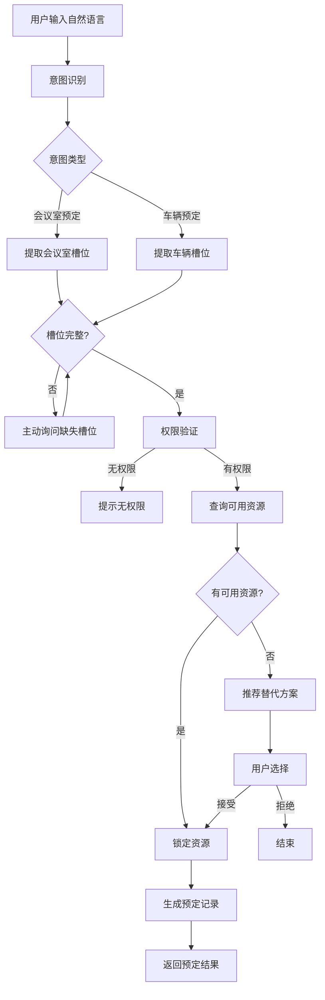

# REQ-02 会议室/车辆预定

## 1. 场景概述

员工通过自然语言预定会议室或公司车辆，系统自动查询可用资源并锁定。支持典型诉求如：
- "明天下午2点订个10人会议室"
- "订一辆车去机场，下午3点出发"
- "帮我订一个带投屏的会议室，后天上午9点到11点"

系统通过意图识别自动区分会议室预定和车辆预定，引导用户补全必要信息后完成预定。

## 2. 用户角色与权限

| 角色 | 权限范围 | 说明 |
|------|----------|------|
| 普通员工 | 预定本人使用 | 只能为自己预定，不能代他人预定 |
| 行政人员 | 可代订 | 可为任意员工代为预定会议室或车辆 |
| 部门主管 | 可代订本部门 | 可为本部门员工代为预定 |

**权限验证**：系统根据用户身份和预定对象自动判断权限，无权限时明确提示。

## 3. 意图与槽位定义

### 3.1 意图定义

```
meeting_room_booking: 会议室预定
vehicle_booking: 车辆预定
```

### 3.2 必填槽位（两个意图通用）

| 槽位 | 类型 | 说明 | 示例 |
|------|------|------|------|
| date | date | 预定日期 | "明天"、"2026-03-15" |
| start_time | time | 开始时间 | "下午2点"、"14:00" |
| end_time | time | 结束时间 | "下午4点"、"16:00" |

### 3.3 会议室选填槽位

| 槽位 | 类型 | 说明 | 示例 |
|------|------|------|------|
| capacity | number | 容纳人数 | "10人"、"20人左右" |
| equipment | array | 设备要求 | ["投屏","白板"] |

### 3.4 车辆选填槽位

| 槽位 | 类型 | 说明 | 示例 |
|------|------|------|------|
| destination | string | 目的地 | "首都机场"、"中关村" |
| purpose | string | 用途 | "客户拜访"、"会议" |

### 3.5 槽位补全策略

当必填槽位缺失时，系统主动询问：
- 缺少时间："请问预定几点到几点？"
- 缺少日期："请问预定哪天的？"
- 会议室缺少人数："请问预计多少人使用？"

## 4. 业务流程



## 5. 业务规则

### 5.1 时间规则
- **时效性**：预定开始时间不能早于当前时间
- **时长限制**：单次预定最长 8 小时，超出需特殊审批
- **签到规则**：预定开始后 15 分钟内未签到，系统自动释放资源

### 5.2 会议室规则
- **容量匹配**：按实际参会人数匹配合适容量的会议室
- **设备匹配**：优先分配满足设备要求的会议室
- **冲突检测**：不能与已有预定在时间上重叠

### 5.3 车辆规则
- **目的地匹配**：根据目的地和可用司机分配车辆
- **时间匹配**：确保车辆在预定时间段内可用
- **冲突检测**：同一车辆不能在同一时间段被多次预定

### 5.4 通用规则
- **幂等性**：相同请求幂等处理，避免重复预定
- **提前预定**：最早可提前 30 天预定
- **取消规则**：开始前 30 分钟可免费取消

## 6. 风险等级

**低风险 - 全自动执行**

- 无需人工审批
- 系统自动完成资源查询和锁定
- 异常情况自动处理或提示用户

## 7. 工具调用

### 7.1 calendar_tool - 会议室管理

#### 查询可用会议室
```json
{
  "action": "query_available",
  "params": {
    "date": "2026-03-15",
    "start_time": "14:00",
    "end_time": "16:00",
    "capacity": 10,
    "equipment": ["投屏"]
  }
}
```

**返回**：
```json
{
  "available_rooms": [
    {
      "room_id": "R101",
      "room_name": "第一会议室",
      "capacity": 12,
      "equipment": ["投屏", "白板"],
      "location": "3楼A区"
    }
  ]
}
```

#### 锁定会议室
```json
{
  "action": "book",
  "params": {
    "room_id": "R101",
    "date": "2026-03-15",
    "start_time": "14:00",
    "end_time": "16:00",
    "booker_id": "EMP001",
    "idempotency_key": "booking_meeting_202603151400_R101"
  }
}
```

**返回**：
```json
{
  "success": true,
  "booking_id": "BK2026031500001",
  "room_name": "第一会议室",
  "qr_code": "https://checkin.example.com/BK2026031500001"
}
```

### 7.2 vehicle_tool - 车辆管理

#### 查询可用车辆
```json
{
  "action": "query_available",
  "params": {
    "date": "2026-03-15",
    "start_time": "15:00",
    "end_time": "17:00",
    "destination": "首都机场"
  }
}
```

**返回**：
```json
{
  "available_vehicles": [
    {
      "vehicle_id": "V001",
      "vehicle_type": "商务车",
      "plate_number": "京A12345",
      "driver": "张师傅",
      "capacity": 7
    }
  ]
}
```

#### 预定车辆
```json
{
  "action": "book",
  "params": {
    "vehicle_id": "V001",
    "date": "2026-03-15",
    "start_time": "15:00",
    "end_time": "17:00",
    "destination": "首都机场",
    "purpose": "客户接送",
    "booker_id": "EMP001",
    "idempotency_key": "booking_vehicle_202603151500_V001"
  }
}
```

**返回**：
```json
{
  "success": true,
  "booking_id": "VB2026031500001",
  "vehicle_info": "京A12345 商务车",
  "driver_contact": "138****1234"
}
```

### 7.3 幂等策略

使用 `idempotency_key` 防止重复预定：
- 格式：`booking_{type}_{datetime}_{resource_id}`
- 相同 key 的重复请求返回已有预定结果
- key 有效期 24 小时

## 8. 异常处理

| 异常场景 | 处理方式 | 用户提示 |
|----------|----------|----------|
| 无可用资源 | 推荐最近可用时间段或替代资源 | "当前时段无可用会议室，最近可用时间为15:00，是否预定？" |
| 预定冲突 | 提示冲突详情，建议修改时间 | "该会议室14:00-15:00已被预定，请调整时间" |
| 外部系统超时 | 重试3次，失败后提示稍后重试 | "系统繁忙，请稍后重试" |
| 权限不足 | 明确提示权限要求 | "您无权代他人预定，请联系行政人员" |
| 时间格式错误 | 引导用户重新输入 | "请确认时间格式，例如：下午2点到4点" |
| 网络异常 | 保存草稿，恢复后继续 | "网络异常，已保存您的预定信息，恢复后自动提交" |

## 9. 审计要求

### 9.1 审计日志
记录所有预定操作的完整审计日志：
- 操作人ID、操作时间、操作类型
- 资源ID、预定时间段
- 操作结果（成功/失败）
- 客户端IP、设备信息

### 9.2 审计查询
支持按时间范围、操作人、资源类型查询审计日志。

### 9.3 数据保留
- 预定记录保留 1 年
- 审计日志保留 3 年
- 支持数据导出和报表生成

## 10. 测试用例

### 10.1 正常场景

| 编号 | 测试场景 | 输入 | 预期结果 |
|------|----------|------|----------|
| TC-001 | 正常预定会议室 | "明天下午2点到4点，订一个10人会议室" | 成功预定，返回会议室详情和签到二维码 |
| TC-002 | 正常预定车辆 | "后天上午9点订车去首都机场" | 成功预定，返回车辆信息和司机联系方式 |
| TC-003 | 带设备要求的预定 | "明天上午10点，订一个带投屏的会议室，6人" | 成功预定带投屏设备的会议室 |

### 10.2 边界场景

| 编号 | 测试场景 | 输入 | 预期结果 |
|------|----------|------|----------|
| TC-004 | 最大时长预定 | "明天全天8点到16点订会议室" | 成功预定（8小时），系统提示已达最大时长 |
| TC-005 | 超时长预定 | "明天全天8点到17点订会议室" | 提示"单次预定最长8小时，请调整时间" |
| TC-005 | 最小提前时间 | "现在订一个会议室，马上开始" | 提示"预定时间不能早于当前时间，请选择未来时间" |
| TC-006 | 跨天预定尝试 | "明天晚上11点到后天凌晨2点" | 提示"单次预定不能跨天，请分开预定" |

### 10.3 异常场景

| 编号 | 测试场景 | 输入 | 预期结果 |
|------|----------|------|----------|
| TC-007 | 无可用资源 | 已知所有会议室已满时段的预定请求 | 提示"当前时段无可用会议室"，推荐最近可用时间 |
| TC-008 | 重复预定 | 相同参数快速提交两次 | 第二次返回"您已预定该资源"，返回原预定信息 |
| TC-009 | 权限越界 | 普通员工尝试代他人预定 | 提示"您无权代他人预定，请联系行政人员" |