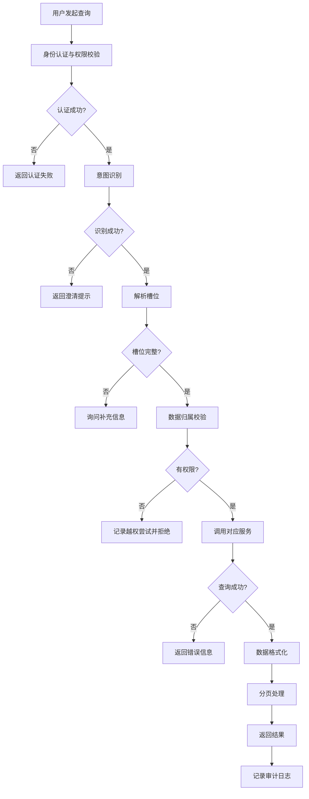

# REQ-03 综合查询

> **文档定位（2026-10-06）**：本文件描述产品/场景/架构设计，包含目标能力与示例，不作为当前实现或上线验收证明。实现及验证范围以 [当前状态](../guides/当前状态.md) 为准，后续任务以 [开发计划](../planning/开发计划.md) 为准。原有版本和修订记录用于追溯。

## 1. 场景概述

员工通过自然语言查询个人行政事务状态，包括但不限于：
- “我上个月报销到哪一步了？”
- “我的请假批了吗？”
- “我还剩几天年假？”
- “我提交的设备采购任务进度如何？”

系统通过意图识别提取查询类型、时间范围等关键信息，调用相应服务获取数据并以结构化格式返回。

## 2. 用户角色与权限

| 角色 | 权限范围 | 说明 |
|------|----------|------|
| 普通员工 | 仅本人数据 | 通过身份认证后只能查询自己的任务、假期、报销等数据 |
| 部门管理员 | 本部门数据 | 可查询本部门下属员工的汇总数据 |
| 系统管理员 | 全部数据 | 可查询任何员工的数据，用于审计和问题排查 |

**权限校验机制**：
- 每次查询必须验证当前用户身份
- 查询参数中不得包含他人用户ID（管理员除外）
- 所有越权查询尝试记录审计日志

## 3. 意图与槽位定义

### 3.1 意图定义

| 意图 | 标识 | 描述 | 示例 |
|------|------|------|------|
| 状态查询 | `status_query` | 查询各类行政事务的状态信息 | “我的报销到哪一步了” |

### 3.2 槽位定义

| 槽位 | 标识 | 类型 | 必填 | 说明 | 示例值 |
|------|------|------|------|------|--------|
| 查询类型 | `query_type` | enum | 是 | 指定查询的数据类别 | 任务进度、假期余额、报销状态 |
| 时间范围 | `time_range` | date_range | 否 | 查询的时间区间，默认最近30天 | “上个月”、“2024年第一季度” |
| 任务ID | `task_id` | string | 否 | 特定任务的标识符，用于精确查询 | “TK20240315001” |
| 查询对象 | `query_target` | string | 否 | 管理员查询时指定员工标识 | “张三”、“工号10086” |

### 3.3 意图识别规则

```yaml
intent_rules:
  - pattern: "(报销|费用|发票).*(状态|进度|哪一步|怎么样)"
    intent: status_query
    query_type: 报销状态
    
  - pattern: "(请假|年假|事假|病假|休假).*(批|通过|剩余|余额|天数)"
    intent: status_query
    query_type: 假期余额
    
  - pattern: "(任务|采购|申请|流程).*(进度|状态|怎么样|哪一步)"
    intent: status_query
    query_type: 任务进度
```

## 4. 业务流程



## 5. 业务规则

### 5.1 数据归属校验
- 普通员工：查询条件必须包含 `user_id = 当前用户ID`
- 部门管理员：查询条件为 `department_id = 当前用户部门ID`
- 系统管理员：无限制，但必须记录审计日志

### 5.2 时间范围处理
- 默认时间范围：最近30天
- 支持自然语言时间解析：“上个月”、“本周”、“2024年第一季度”
- 时间范围上限：最早不超过1年前

### 5.3 结果排序
- 默认按时间倒序（最新在前）
- 支持指定排序字段：创建时间、更新时间、状态变更时间

### 5.4 分页支持
- 默认每页：20条
- 最大每页：100条
- 返回分页元数据：总条数、当前页、总页数

### 5.5 查询类型映射

| 查询类型 | 后端服务 | 主要字段 |
|----------|----------|----------|
| 任务进度 | task_service | 任务名称、当前状态、负责人、预计完成时间 |
| 假期余额 | leave_service | 假期类型、总天数、已用天数、剩余天数 |
| 报销状态 | expense_service | 报销单号、金额、审批状态、当前节点 |

> **实现状态（2026-09-20 Batch 15）**：✅ **已实现**（`core/status_query.py` + 编排器 `status_query` 分支）。
> 查询类型由场景 §3.3 的关键词规则归一（LLM 给出判定时以其为准）；时间范围支持最近 N 天/月、
> 上个月、本月、本周、今年、`YYYY年M月`，默认 30 天、上限 1 年；**归属一律为本人并下推 SQL**
> （`tasks.user_id = 当前用户`），按单据号查他人单据时明确拒绝且不泄漏内容；只读——不建任务、
> 不改状态、不调业务工具。答复会带出当前待审人与在途请假单；假期额度取 HR 系统，HR 不可用时
> 回退本地默认额度并如实标注来源。
>
> 与本节设计的差异（实现口径，非缺失）：
> - `query_target`（管理员查他人，TC006）**未实现**——姓名到账号的解析存在歧义风险，
>   一期只做本人查询；管理员跨用户查询走 `/tasks/my?scope=dept|all`（带审计）。
> - 分页按对话场景适配：列表最多展示 5 条并提示总数，超过则引导到「我的任务」页；
>   未做对话内的翻页命令。
> - 排序只支持时间倒序；§9 的审计事件以 `action=status_query`（只记查询类型与结果条数，
>   不记查询内容与单据明细）落 `audit_logs`。
> 验证：单元 71 个用例（状态查询 60 + 工具结果解析 11）+ 编排器 10 个用例，真实 PG 集成 10 个用例；
E2E 冒烟第 10~11 步（含「只读不新增任务」与「回复中的受理编号可回查」断言）。

## 6. 风险等级

**风险等级：低**

- 全自动处理，无人工干预环节
- 只读操作，不修改任何数据
- 权限控制严格，数据隔离完善
- 不涉及资金操作或敏感信息修改

**风险控制措施**：
- 查询频率限制：单用户每分钟最多60次查询
- 异常查询监控：短时间内大量查询触发告警
- 敏感数据脱敏：报销金额等信息按需脱敏显示

## 7. 工具调用

### 7.1 内部服务调用

```yaml
services:
  - name: task_service.get_my_tasks
    description: 获取当前用户的任务列表
    parameters:
      user_id: string
      status: string (optional)
      time_range: date_range (optional)
      page: integer
      page_size: integer
    
  - name: leave_service.get_balance
    description: 获取假期余额信息
    parameters:
      user_id: string
      leave_type: string (optional)
      
  - name: expense_service.get_status
    description: 获取报销状态
    parameters:
      user_id: string
      expense_id: string (optional)
      time_range: date_range (optional)
```

### 7.2 外部系统接口

```yaml
external_systems:
  - name: HR系统
    interface: REST API
    endpoint: /api/v1/employees/{id}/leave-balance
    timeout: 5000ms
    retry: 2
    
  - name: 财务系统
    interface: REST API  
    endpoint: /api/v1/expenses/query
    timeout: 8000ms
    retry: 2
    
  - name: OA系统
    interface: REST API
    endpoint: /api/v1/tasks/search
    timeout: 5000ms
    retry: 2
```

## 8. 异常处理

### 8.1 业务异常

| 异常类型 | 错误码 | 处理方式 | 用户提示 |
|----------|--------|----------|----------|
| 无查询结果 | 404001 | 返回空数据集 | “未找到相关记录，请检查查询条件” |
| 槽位缺失 | 400001 | 澄清询问 | “请问您想查询哪方面的信息？” |
| 意图识别失败 | 400002 | 引导重新输入 | “抱歉，我没理解您的意思，请尝试更具体的描述” |
| 权限不足 | 403001 | 拒绝并记录 | “您没有权限查询此信息” |

### 8.2 系统异常

| 异常类型 | 处理方式 | 用户提示 | 降级策略 |
|----------|----------|----------|----------|
| 外部系统超时 | 重试2次后返回错误 | “系统繁忙，请稍后重试” | 返回缓存数据（如有） |
| 外部系统不可用 | 记录错误并返回 | “相关系统暂时不可用” | 提供人工客服入口 |
| 数据库异常 | 记录详细日志 | “系统内部错误” | 通知运维人员 |
| 网络异常 | 重试机制 | “网络连接不稳定” | 建议切换网络 |

### 8.3 重试策略

```yaml
retry_policy:
  max_retries: 2
  backoff_strategy: exponential
  initial_delay: 1000ms
  max_delay: 5000ms
  retryable_errors:
    - timeout
    - connection_refused
    - service_unavailable
```

## 9. 审计要求

### 9.1 审计事件类型

| 事件类型 | 触发条件 | 记录内容 |
|----------|----------|----------|
| 查询发起 | 用户发起任何查询 | 用户ID、查询内容、时间戳 |
| 查询成功 | 成功返回结果 | 查询类型、结果数量、耗时 |
| 查询失败 | 查询过程中出错 | 错误类型、错误详情、用户ID |
| 越权尝试 | 权限校验失败 | 用户ID、尝试查询的数据、来源IP |
| 异常模式 | 检测到异常查询模式 | 用户ID、查询频率、查询模式 |

### 9.2 审计日志格式

```json
{
  "timestamp": "2024-03-15T10:30:00Z",
  "event_type": "query_success",
  "user_id": "emp_10086",
  "user_role": "employee",
  "query_type": "expense_status",
  "query_params": {
    "time_range": "2024-02-01~2024-02-29",
    "page": 1,
    "page_size": 20
  },
  "result_count": 3,
  "response_time_ms": 156,
  "ip_address": "192.168.1.100",
  "user_agent": "Mozilla/5.0..."
}
```

### 9.3 审计数据保留

- 在线审计日志保留：90天
- 归档审计日志保留：3年
- 敏感操作日志保留：5年

## 10. 测试用例

### 10.1 功能测试

| 用例ID | 测试场景 | 输入 | 预期输出 | 优先级 |
|--------|----------|------|----------|--------|
| TC001 | 查询报销状态 | “我上个月的报销到哪一步了” | 返回报销列表，包含状态、金额、时间 | 高 |
| TC002 | 查询假期余额 | “我还剩几天年假” | 返回年假余额：总天数、已用、剩余 | 高 |
| TC003 | 查询任务进度 | “我的采购任务进度如何” | 返回任务列表及当前状态 | 高 |
| TC004 | 指定时间范围 | “2024年1月的报销记录” | 返回指定时间段内的报销数据 | 中 |
| TC005 | 指定任务ID | “查询任务TK20240315001的状态” | 返回特定任务的详细信息 | 中 |
| TC006 | 管理员查询他人 | “查询张三的请假情况” | 返回张三的请假数据（需管理员权限） | 中 |

### 10.2 异常测试

| 用例ID | 测试场景 | 输入 | 预期输出 | 优先级 |
|--------|----------|------|----------|--------|
| TC007 | 无查询结果 | 查询不存在的任务 | 返回空结果和友好提示 | 高 |
| TC008 | 槽位缺失 | “查询状态”（未指定类型） | 返回澄清询问 | 高 |
| TC009 | 意图识别失败 | “今天天气怎么样” | 返回引导提示 | 中 |
| TC010 | 越权查询 | 普通员工查询他人数据 | 返回权限错误并记录审计 | 高 |
| TC011 | 外部系统超时 | 模拟财务系统超时 | 返回重试提示或降级结果 | 中 |
| TC012 | 并发查询 | 同时发起100个查询 | 系统正常响应，无超时或错误 | 低 |

### 10.3 性能测试

| 用例ID | 测试场景 | 性能指标 | 目标值 |
|--------|----------|----------|--------|
| TC013 | 单次查询响应时间 | 平均响应时间 | < 2秒 |
| TC014 | 并发查询处理 | 并发用户数 | 支持500并发 |
| TC015 | 大数据量分页 | 10万条数据分页查询 | 首页响应 < 1秒 |
| TC016 | 外部系统调用 | 平均调用耗时 | < 3秒 |

### 10.4 安全测试

| 用例ID | 测试场景 | 测试方法 | 预期结果 |
|--------|----------|----------|----------|
| TC017 | SQL注入 | 在查询参数中注入SQL语句 | 系统过滤特殊字符，查询正常 |
| TC018 | 越权访问 | 篡改用户ID参数 | 系统校验失败，拒绝访问 |
| TC019 | 敏感信息泄露 | 查询返回数据检查 | 金额等信息按权限脱敏 |
| TC020 | 审计日志完整性 | 执行操作后检查日志 | 所有操作均有完整审计记录 |
