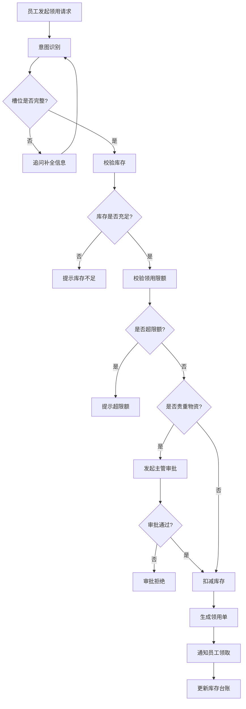

# REQ-04 物资领用

## 1. 场景概述
员工通过自然语言向行政AI系统发起办公物资领用请求，例如：
- "领一箱A4纸"
- "领两支签字笔"
- "领一个插线板"

系统自动识别意图，补全必要信息，校验库存和领用限额后执行出库操作，并通知员工领取。

## 2. 用户角色
- **发起人**：普通员工（领用申请人）
- **确认人**：行政人员（审核领用合理性）
- **执行人**：仓库管理员（物资出库）

## 3. 意图槽位
- **意图标识**：`material_request`
- **必填槽位**：
  - `item_name`：物资名称（如"A4纸"、"签字笔"）
  - `quantity`：数量（整数，单位根据物资类型自动匹配）
- **可选槽位**：
  - `reason`：用途说明
  - `urgency`：紧急程度（普通/紧急，默认"普通"）

## 4. 业务流程

## 5. 业务规则
1. **单次领用限制**：单次领用数量不得超过当前库存量
2. **月度领用限额**：
   - A4纸：每人每月2箱
   - 签字笔：每人每月5支
   - 其他物资根据类别设定限额
3. **贵重物资审批**：单价超过100元的物资需主管审批
4. **紧急领用通道**：标记为"紧急"的领用请求优先处理，跳过常规审批流程。**例外**：贵重物资（单价 > 100 元）不适用紧急通道，仍需主管审批
5. **库存预警**：库存低于安全阈值时自动触发补货提醒

## 6. 风险等级
**中等风险**：系统自动执行领用流程，但全程留痕，支持事后审计。

## 7. 工具调用
- `material_tool.check_stock(item_name)` - 查询物资库存
- `material_tool.check_quota(user_id, item_name)` - 查询用户领用限额
- `material_tool.deduct(item_name, quantity)` - 扣减库存
- `material_tool.create_order(user_id, item_name, quantity, ...)` - 生成领用单

## 8. 异常处理
1. **库存不足**：提示当前库存数量，建议减少数量或选择替代品
2. **超领用限额**：提示本月已领用数量和剩余限额
3. **物资不存在**：提示物资名称无法识别，提供相似物资建议
4. **系统超时**：记录操作日志，提示用户稍后重试

## 9. 审计要求
- 记录所有领用请求的完整操作日志
- 包含：操作人、操作时间、物资信息、数量、审批状态
- 日志保留期限：3年
- 支持按时间、人员、物资类型进行审计查询

## 10. 测试用例

### 正常场景
1. **标准领用**：员工领用1箱A4纸，库存充足，未超限额，成功生成领用单
2. **多物资领用**：员工同时领用签字笔2支和笔记本1本，系统正确处理
3. **紧急领用**：员工标记紧急领用插线板，系统走快速通道处理

### 边界场景
1. **库存临界**：领用数量等于当前库存，系统允许领用并触发补货提醒
2. **限额临界**：本月已领用1箱A4纸，再领用1箱（达到限额），系统允许
3. **贵重物资临界**：领用单价100元的物资，无需审批

### 异常场景
1. **库存不足**：领用5箱A4纸，库存仅剩2箱，系统拒绝并提示
2. **超限额**：本月已领用2箱A4纸，再领用1箱，系统拒绝并提示
3. **物资不存在**：领用"激光打印机"，系统提示无法识别并提供相似物资建议