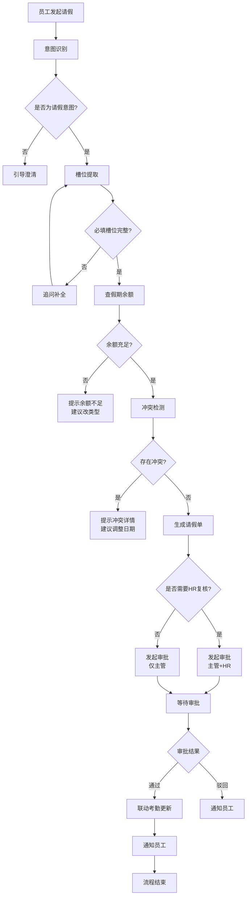

# REQ-05 请假申请

## 1. 场景概述

员工通过自然语言向行政AI系统发起请假申请，系统自动识别请假意图，提取关键信息（请假类型、日期、事由等），校验假期余额和日程冲突，生成请假单并发起审批流程。

**典型用户表达：**
- "我想请两天年假"
- "下周请一天病假"
- "请三天事假，需要处理家庭事务"
- "申请调休一天，上周六加班了"
- "后天开始请两天假，工作交接给小王"

## 2. 用户角色

| 角色 | 职责 | 权限 |
|------|------|------|
| **员工** | 发起请假申请 | 创建、查看、撤回自己的请假单 |
| **直属主管** | 审批请假申请 | 审批/驳回下属请假单 |
| **HR** | 复核长假申请 | 复核连续3天以上请假、查看所有请假记录 |
| **行政AI** | 意图识别、信息采集、自动校验 | 余额查询、冲突检测、流程推进 |

## 3. 意图槽位

### 意图定义
```
intent: leave_request
description: 员工请假申请
```

### 槽位定义

| 槽位名 | 类型 | 必填 | 说明 | 示例值 |
|--------|------|------|------|--------|
| `leave_type` | enum | ✅ | 请假类型 | 年假、调休、事假、病假 |
| `start_date` | date | ✅ | 开始日期 | 2026-09-17 |
| `end_date` | date | ✅ | 结束日期 | 2026-09-18 |
| `reason` | string | ❌ | 请假事由 | 处理家庭事务 |
| `handover` | string | ❌ | 工作交接人 | 小王、张三 |
| `contact` | string | ❌ | 紧急联系方式 | 13800138000 |

### 槽位补全策略
- **日期解析**：支持相对日期（"明天"、"下周三"）和绝对日期（"9月20日"）
- **类型推断**：根据上下文推断（"不舒服"→病假，"家里有事"→事假）
- **默认值**：end_date默认等于start_date（单日请假）

## 4. 业务流程



## 5. 业务规则

### 余额校验规则
| 请假类型 | 余额校验 | 说明 |
|----------|----------|------|
| 年假 | ✅ 必须校验 | 余额不足时提示剩余天数，建议改类型 |
| 调休 | ✅ 必须校验 | 基于加班时长转换，余额不足时提示 |
| 病假 | ❌ 不校验余额 | 需上传病假条（3天以上） |
| 事假 | ❌ 不校验余额 | 必须说明请假原因 |

### 冲突检测规则
- **会议冲突**：不能与已标记为"重要"的会议冲突
- **出差冲突**：不能与已批准的出差申请冲突
- **考勤冲突**：不能与已有的考勤记录冲突

### 审批规则
| 条件 | 审批流程 |
|------|----------|
| 连续请假 ≤ 2天 | 直属主管审批 |
| 连续请假 > 2天 | 直属主管审批 + HR复核 |
| 病假 ≥ 3天 | 直属主管审批 + HR复核 + 病假条上传 |

### 考勤联动规则
- 请假期间自动标记考勤状态为"请假"
- 考勤备注中记录请假单号和类型
- 与月度考勤统计自动关联

## 6. 风险等级

**风险等级：中**

| 风险项 | 说明 | 缓解措施 |
|--------|------|----------|
| 数据准确性 | 余额计算错误可能导致纠纷 | 实时同步HR系统数据 |
| 流程合规 | 审批流程绕过 | 强制走审批流，不可跳过 |
| 业务连续性 | 关键岗位同时请假 | 冲突检测覆盖团队排班 |
| 审计追溯 | 操作记录不完整 | 全链路日志记录 |

**执行方式：** 自动执行并留痕，所有操作记录可追溯。

## 7. 工具调用

### 工具清单

```yaml
tools:
  - name: hr_tool.check_balance
    description: 查询员工假期余额
    parameters:
      employee_id: string    # 员工工号
      leave_type: string     # 请假类型
      year: number           # 年份
    returns:
      total: number          # 总余额
      used: number           # 已使用
      remaining: number      # 剩余

  - name: hr_tool.check_conflict
    description: 检测请假日期冲突
    parameters:
      employee_id: string    # 员工工号
      start_date: string     # 开始日期
      end_date: string       # 结束日期
    returns:
      has_conflict: boolean  # 是否冲突
      conflicts: array       # 冲突详情

  - name: approval_tool.create_approval
    description: 创建审批流程
    parameters:
      type: string           # 审批类型
      applicant_id: string   # 申请人
      approvers: array       # 审批人列表
      data: object           # 请假单数据
    returns:
      approval_id: string    # 审批单号

  - name: attendance_tool.update
    description: 更新考勤记录
    parameters:
      employee_id: string    # 员工工号
      date: string           # 日期
      status: string         # 状态
      remark: string         # 备注
    returns:
      success: boolean       # 更新结果
```

### 调用时序
1. `hr_tool.check_balance` → 校验余额
2. `hr_tool.check_conflict` → 检测冲突
3. `approval_tool.create_approval` → 发起审批
4. `attendance_tool.update` → 审批通过后更新考勤

## 8. 异常处理

| 异常场景 | 处理方式 | 用户提示 |
|----------|----------|----------|
| 余额不足 | 终止流程，提示余额信息 | "您的年假剩余X天，不足Y天。建议改请事假或缩短假期。" |
| 日期冲突 | 终止流程，展示冲突详情 | "您申请的日期与以下日程冲突：[冲突列表]，请调整日期。" |
| 审批超时 | 自动提醒审批人，超24小时升级 | "您的请假申请正在审批中，已提醒审批人处理。" |
| HR系统异常 | 重试3次后降级处理 | "暂时无法查询假期余额，请稍后重试或联系HR。" |
| 病假条上传失败 | 提示重新上传 | "病假条上传失败，请检查文件格式后重试。" |

### 降级策略
- HR系统不可用时，允许员工先提交申请，后续人工补录余额校验
- 冲突检测服务异常时，提示员工自行检查日程

## 9. 审计要求

### 日志记录
```json
{
  "event": "leave_request",
  "timestamp": "2026-09-16T10:30:00Z",
  "employee_id": "EMP001",
  "leave_type": "年假",
  "start_date": "2026-09-17",
  "end_date": "2026-09-18",
  "days": 2,
  "balance_check": {
    "remaining": 5,
    "passed": true
  },
  "conflict_check": {
    "has_conflict": false
  },
  "approval_id": "APR20260916001",
  "status": "approved",
  "approver": "MGR001"
}
```

### 审计要点
- **完整记录**：每次请假申请的全链路日志
- **余额变动**：假期余额的每次扣减和恢复记录
- **审批轨迹**：审批人、审批时间、审批意见
- **异常事件**：所有异常处理的详细记录
- **数据一致性**：定期核对HR系统与本地记录

### 保留期限
- 请假记录：保留3年
- 审批日志：保留2年
- 异常日志：保留1年

## 10. 测试用例

### 功能测试

| 用例ID | 场景 | 输入 | 预期结果 |
|--------|------|------|----------|
| TC-01 | 正常请年假 | "请两天年假，明天和后天" | 余额校验通过，生成请假单，发起审批 |
| TC-02 | 余额不足 | 年假剩余1天，申请3天 | 提示余额不足，建议调整 |
| TC-03 | 会议冲突 | 请假日期有重要会议 | 提示冲突，建议改期 |
| TC-04 | 长假HR复核 | 连续请假4天 | 审批流包含HR复核节点 |
| TC-05 | 病假3天以上 | 请病假4天 | 提示上传病假条 |
| TC-06 | 事假需说明 | 请事假但未说明原因 | 追问请假原因 |
| TC-07 | 槽位补全 | "我想请假" | 追问类型和日期 |
| TC-08 | 相对日期解析 | "下周三请一天假" | 正确解析为具体日期 |

### 异常测试

| 用例ID | 场景 | 输入 | 预期结果 |
|--------|------|------|----------|
| TC-E01 | HR系统超时 | 网络异常 | 重试后降级处理，提示稍后重试 |
| TC-E02 | 无效日期 | 结束日期早于开始日期 | 提示日期错误，重新输入 |
| TC-E03 | 审批超时 | 审批人24小时未处理 | 自动提醒，超时升级 |
| TC-E04 | 重复申请 | 同一日期已有请假单 | 提示重复，查看详情 |

### 集成测试

| 用例ID | 场景 | 验证点 |
|--------|------|--------|
| TC-I01 | 审批通过后考勤更新 | 考勤状态自动标记为"请假" |
| TC-I02 | 余额扣减一致性 | HR系统余额与本地记录一致 |
| TC-I03 | 多系统数据同步 | 请假信息同步至日历、考勤、HR系统 |