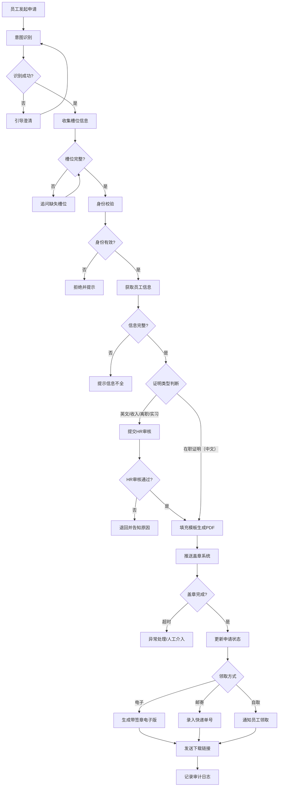

# REQ-06 证明开具

## 1. 场景概述

员工通过AI行政助手申请开具各类证明文件，常见对话示例：

- "帮我开一份在职证明"
- "我要开收入证明，用于银行贷款"
- "我需要一份英文版的在职证明，寄到家里"
- "开两份实习证明，要盖章的"

系统识别员工身份后，自动获取员工信息填充模板，生成PDF并推送至盖章系统，完成后通知员工领取。

## 2. 用户角色

| 角色 | 职责 | 权限 |
|------|------|------|
| 员工 | 发起证明申请 | 申请、查看进度、下载/领取 |
| HR | 审核涉及敏感信息的证明（收入证明、英文版） | 审核、退回、备注 |
| 行政 | 盖章确认 | 盖章、登记 |

## 3. 意图槽位

### 意图定义

```yaml
intent: certificate_request
description: 员工申请开具各类证明文件
confidence_threshold: 0.85
```

### 槽位配置

| 槽位名 | 类型 | 必填 | 说明 | 示例值 |
|--------|------|------|------|--------|
| certificate_type | enum | 是 | 证明类型 | 在职证明、收入证明、离职证明、实习证明 |
| purpose | string | 是 | 证明用途 | 银行贷款、签证办理、子女入学、购房 |
| copies | int | 否 | 申请份数（默认1，最大3） | 1、2、3 |
| language | enum | 否 | 语言版本（默认中文） | 中文、英文 |
| delivery | enum | 否 | 领取方式（默认自取） | 自取、邮寄、电子 |

### 槽位填充策略

```yaml
slot_filling:
  - slot: certificate_type
    prompt: "请问您需要开具哪种证明？在职证明、收入证明、离职证明还是实习证明？"
    
  - slot: purpose
    prompt: "请问这份证明的用途是什么？（如：银行贷款、签证办理、子女入学等）"
    
  - slot: copies
    prompt: "请问需要几份？每人每月同类证明最多可开3份。"
    default: 1
    validation: "1-3"
    
  - slot: language
    prompt: "需要中文版还是英文版？"
    default: "中文"
    
  - slot: delivery
    prompt: "希望自取、邮寄还是电子版？"
    default: "自取"
```

## 4. 业务流程



## 5. 业务规则

### 5.1 自动填充规则

**在职证明**自动填充字段：

| 字段 | 数据来源 | 示例 |
|------|----------|------|
| 姓名 | hr_system.employee.name | 张三 |
| 工号 | hr_system.employee.employee_id | EMP20230101 |
| 部门 | hr_system.employee.department | 技术部 |
| 入职日期 | hr_system.employee.hire_date | 2023-01-01 |
| 职位 | hr_system.employee.position | 高级工程师 |

**收入证明**额外填充：

| 字段 | 数据来源 | 说明 |
|------|----------|------|
| 月收入 | payroll_system.salary.monthly | 需HR审核 |
| 年收入 | payroll_system.salary.annual | 需HR审核 |
| 税前/税后 | employee_request | 默认税前 |

### 5.2 审核规则

| 证明类型 | 审核要求 | 审核人 | 审核时限 |
|----------|----------|--------|----------|
| 在职证明（中文） | 无需审核 | - | - |
| 在职证明（英文） | 需HR审核 | HR专员 | 1工作日 |
| 收入证明 | 需HR审核 | HR专员 | 1工作日 |
| 离职证明 | 需HR审核 | HR主管 | 2工作日 |
| 实习证明 | 需HR审核 | HR专员 | 1工作日 |

### 5.3 数量限制

```
每人每月同类证明 ≤ 3份
超额申请 → 拒绝，提示"本月该类型证明已达上限，请下月申请或联系HR"
```

### 5.4 电子签章规则

- 电子版证明自动附加数字签章
- 签章使用企业CA证书
- 签章有效期与证明有效期一致
- 电子版PDF含验证二维码

## 6. 风险等级

**等级：中**

| 风险项 | 说明 | 缓解措施 |
|--------|------|----------|
| 薪资信息泄露 | 收入证明涉及敏感数据 | HR审核确认 |
| 身份冒用 | 非本人申请 | 系统身份校验+登录验证 |
| 模板错误 | 信息填充错误 | 模板版本管理+生成预览 |
| 盖章滥用 | 无限制开具 | 月度数量限制 |

**执行策略：** 自动执行，在职证明（英文）、收入证明、离职证明、实习证明需HR确认

## 7. 工具调用

### 7.1 工具列表

```yaml
tools:
  - name: hr_tool.get_employee_info
    description: 获取员工基本信息
    input:
      employee_id: string  # 员工工号
    output:
      name: string
      department: string
      position: string
      hire_date: date
      status: string  # 在职/离职
    error_codes:
      - EMPLOYEE_NOT_FOUND
      - EMPLOYEE_INACTIVE

  - name: certificate_tool.generate
    description: 根据模板生成证明PDF
    input:
      template_id: string  # 模板ID
      data: object  # 填充数据
      language: string  # 中文/英文
      copies: int
    output:
      file_url: string  # PDF文件地址
      file_id: string
    error_codes:
      - TEMPLATE_NOT_FOUND
      - DATA_INCOMPLETE
      - GENERATION_FAILED

  - name: seal_tool.request_seal
    description: 推送盖章系统申请盖章
    input:
      file_id: string
      seal_type: string  # 公章/电子章
      urgency: string  # 普通/加急
    output:
      request_id: string
      status: string
    error_codes:
      - SEAL_SYSTEM_TIMEOUT
      - SEAL_REJECTED
```

### 7.2 调用示例

```json
{
  "tool": "hr_tool.get_employee_info",
  "params": {
    "employee_id": "EMP20230101"
  }
}
```

```json
{
  "tool": "certificate_tool.generate",
  "params": {
    "template_id": "CERT_在职证明_CN_V2",
    "data": {
      "name": "张三",
      "employee_id": "EMP20230101",
      "department": "技术部",
      "position": "高级工程师",
      "hire_date": "2023-01-01",
      "purpose": "银行贷款"
    },
    "language": "中文",
    "copies": 1
  }
}
```

## 8. 异常处理

| 异常场景 | 错误码 | 处理策略 | 用户提示 |
|----------|--------|----------|----------|
| 员工信息不全 | EMP_DATA_INCOMPLETE | 提示员工补充信息 | "您的个人信息不完整，请先完善个人档案后再申请" |
| 模板不存在 | TEMPLATE_NOT_FOUND | 记录日志，转人工 | "该证明模板暂不可用，已转交人工处理" |
| 盖章系统超时 | SEAL_SYSTEM_TIMEOUT | 重试3次，失败转人工 | "盖章系统响应超时，正在重试，请稍候" |
| 月度限额超限 | QUOTA_EXCEEDED | 拒绝申请 | "本月该类型证明已达上限（3份），请下月申请或联系HR" |
| 员工已离职 | EMPLOYEE_INACTIVE | 拒绝申请 | "您已离职，如需证明请联系HR" |
| PDF生成失败 | GENERATION_FAILED | 重试，失败转人工 | "证明生成失败，正在为您转交人工处理" |
| HR审核超时 | HR_REVIEW_TIMEOUT | 自动提醒HR | "审核中，已提醒HR处理，预计1个工作日内完成" |

### 重试策略

```yaml
retry_policy:
  seal_tool.request_seal:
    max_retries: 3
    backoff: exponential  # 5s, 10s, 20s
    fallback: manual_process
    
  certificate_tool.generate:
    max_retries: 2
    backoff: fixed  # 3s
    fallback: manual_process
```

## 9. 审计要求

### 9.1 审计日志字段

```yaml
audit_log:
  - request_id: string        # 申请单号
  - employee_id: string       # 申请人
  - certificate_type: string  # 证明类型
  - purpose: string           # 用途
  - action: string            # 操作类型
  - timestamp: datetime       # 操作时间
  - operator: string          # 操作人
  - result: string            # 操作结果
  - ip_address: string        # IP地址
  - device_info: string       # 设备信息
```

### 9.2 关键审计节点

| 节点 | 记录内容 |
|------|----------|
| 申请提交 | 申请人、证明类型、用途、份数 |
| HR审核 | 审核人、审核结果、审核意见 |
| 盖章完成 | 盖章时间、盖章类型 |
| 领取/下载 | 领取方式、时间、签收人 |

### 9.3 数据保留

- 申请记录保留：3年
- 证明副本保留：1年
- 审计日志保留：5年

## 10. 测试用例

### 10.1 功能测试

| 用例编号 | 测试场景 | 输入 | 预期结果 |
|----------|----------|------|----------|
| TC-06-001 | 正常开具在职证明（中文） | certificate_type=在职证明, purpose=签证办理 | 自动填充信息，生成PDF，推送盖章 |
| TC-06-002 | 正常开具收入证明 | certificate_type=收入证明, purpose=银行贷款 | 提交HR审核，审核通过后生成PDF |
| TC-06-003 | 开具英文版在职证明 | certificate_type=在职证明, language=英文 | 提交HR审核，审核通过后生成英文PDF |
| TC-06-004 | 申请邮寄领取 | delivery=邮寄 | 生成PDF后提示录入快递单号 |
| TC-06-005 | 申请电子版 | delivery=电子 | 生成带数字签章的电子版，发送下载链接 |

### 10.2 异常测试

| 用例编号 | 测试场景 | 输入 | 预期结果 |
|----------|----------|------|----------|
| TC-06-101 | 员工信息不全 | employee缺少department字段 | 提示"个人信息不完整" |
| TC-06-102 | 月度限额超限 | 当月已开3份在职证明 | 拒绝申请，提示限额 |
| TC-06-103 | 盖章系统超时 | seal_tool超时 | 重试3次后转人工 |
| TC-06-104 | 模板不存在 | template_id=不存在的模板 | 转人工处理 |
| TC-06-105 | 已离职员工申请 | employee.status=离职 | 拒绝申请 |

### 10.3 意图识别测试

| 用例编号 | 用户输入 | 期望意图 | 期望槽位 |
|----------|----------|----------|----------|
| TC-06-201 | "帮我开一份在职证明" | certificate_request | type=在职证明 |
| TC-06-202 | "收入证明用于贷款" | certificate_request | type=收入证明, purpose=贷款 |
| TC-06-203 | "我要开证明" | certificate_request | 需追问type和purpose |
| TC-06-204 | "开2份英文在职证明寄到家" | certificate_request | type=在职证明, copies=2, language=英文, delivery=邮寄 |

### 10.4 集成测试

| 用例编号 | 测试场景 | 验证点 |
|----------|----------|--------|
| TC-06-301 | HR审核流程 | 审核通过/退回状态流转正确 |
| TC-06-302 | 盖章系统对接 | 推送成功/超时/失败处理正确 |
| TC-06-303 | 电子签章验证 | 电子版PDF签章可验证 |
| TC-06-304 | 全流程端到端 | 从申请到领取完整流程 |