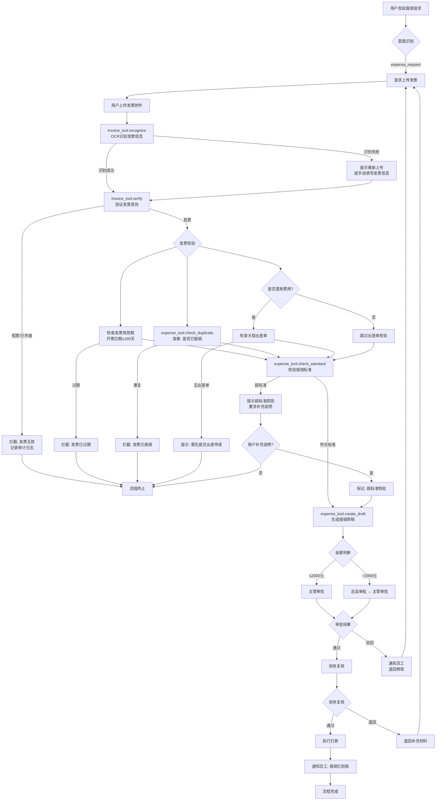

# REQ-07 报销申请

## 1. 场景概述

员工因公务产生的费用（差旅、交通、餐饮、办公、招待等）需要通过系统进行报销。系统需支持发票OCR识别、自动校验报销标准、防重复报销，并在**提交审批前强制人工确认**，确保高风险操作可控。

**典型用户话术：**
- "周五出差酒店发票怎么报销"
- "这张出租车发票能报吗"
- "帮我报销一下昨天的招待餐费"
- "上周出差的费用怎么提交"

## 2. 用户角色

| 角色 | 职责 | 操作权限 |
|------|------|----------|
| 员工 | 发起报销申请，上传发票，填写费用说明 | 创建、编辑、撤回自己的报销单 |
| 主管 | 审批下属报销申请，核实费用合理性 | 审批/驳回下属报销单 |
| 财务 | 复核报销单据，执行打款 | 复核、打款、退回 |

## 3. 意图槽位

```
意图: expense_request

必填槽位:
  - expense_type    : string   # 费用类型: 差旅/交通/餐饮/办公/招待
  - amount          : number   # 报销金额（元）
  - invoice         : file     # 发票附件（图片或PDF）

选填槽位:
  - related_travel_id : string # 关联出差申请单编号
  - description       : string # 费用说明
  - cost_center       : string # 成本中心编码
```

**槽位填充策略：**
1. 用户上传发票图片 → 调用OCR自动识别金额、发票号、开票日期、发票类型
2. 用户描述中提取费用类型 → 匹配 `expense_type`
3. 系统查询用户近期出差单 → 提示关联 `related_travel_id`
4. 用户所属部门默认成本中心 → 自动填充 `cost_center`

## 4. 业务流程



**关键节点标记：**
- 🔴 **人工确认点**：报销草稿生成后，员工必须**手动确认**所有信息无误后才能提交审批
- 🟡 **自动校验**：发票真伪、有效期、查重、标准校验均为系统自动执行
- 🟢 **自动填充**：OCR识别、成本中心、出差单关联为自动填充

## 5. 业务规则

### 5.1 发票规则

| 规则编号 | 规则内容 | 阻断级别 |
|----------|----------|----------|
| INV-001 | 发票开票日期距今≤180天 | 硬阻断 |
| INV-002 | 发票未被其他报销单使用（防重复报销） | 硬阻断 |
| INV-003 | 电子发票需通过税务平台验证真伪 | 硬阻断 |
| INV-004 | 发票金额与报销金额一致 | 硬阻断 |
| INV-005 | 发票抬头需为公司全称 | 硬阻断 |

### 5.2 费用标准规则

| 规则编号 | 规则内容 | 阻断级别 |
|----------|----------|----------|
| STD-001 | 差旅费用需关联有效出差申请单 | 硬阻断 |
| STD-002 | 住宿标准：一线城市≤500元/晚，二线城市≤400元/晚 | 软阻断（超标准需说明） |
| STD-003 | 餐饮标准：≤150元/人/餐 | 软阻断 |
| STD-004 | 交通费用需在合理范围内（与出差地匹配） | 软阻断 |

### 5.3 审批规则

| 规则编号 | 规则内容 | 阻断级别 |
|----------|----------|----------|
| APR-001 | 单笔报销≤2000元：主管审批 | 流程控制 |
| APR-002 | 单笔报销>2000元：总监审批 → 主管审批 | 流程控制 |
| APR-003 | 超差旅标准费用：需特批流程 | 流程控制 |

### 5.4 高风险操作规则

> ⚠️ **强制人工确认**：报销草稿生成后，系统必须展示完整信息（费用类型、金额、发票信息、关联出差单），员工**手动确认无误**后方可提交审批。此为不可跳过环节。

## 6. 风险等级

**风险等级：🔴 高**

| 风险维度 | 说明 |
|----------|------|
| 资金风险 | 涉及实际资金支出，错误报销造成财务损失 |
| 合规风险 | 假发票、重复报销违反财务合规 |
| 操作风险 | 金额填写错误、发票识别错误 |
| 审计风险 | 审批链不完整、记录缺失 |

**缓解措施：**
- 强制人工确认（高风险操作核心防线）
- 发票OCR + 税务平台双重验证
- 防重复报销机制
- 完整审计日志

## 7. 工具调用

### 7.1 发票工具 (invoice_tool)

```python
# OCR识别发票
invoice_tool.recognize(
    file_path: str          # 发票文件路径
) -> InvoiceInfo:
    """
    返回: {
        "invoice_no": "12345678",
        "invoice_code": "044001900211",
        "amount": 350.00,
        "tax_amount": 21.00,
        "total_amount": 371.00,
        "invoice_date": "2026-09-01",
        "seller_name": "XX酒店管理有限公司",
        "invoice_type": "增值税电子普通发票"
    }
    """

# 验证发票真伪
invoice_tool.verify(
    invoice_code: str,      # 发票代码
    invoice_no: str,        # 发票号码
    invoice_date: str,      # 开票日期
    amount: float           # 校验金额
) -> VerifyResult:
    """
    返回: {
        "is_valid": True,
        "is_used": False,
        "verify_source": "国家税务总局全国增值税发票查验平台",
        "message": "查验通过"
    }
    """
```

### 7.2 报销工具 (expense_tool)

```python
# 校验报销标准
expense_tool.check_standard(
    expense_type: str,      # 费用类型
    amount: float,          # 金额
    city_level: str,        # 城市级别（差旅时需要）
    headcount: int = 1      # 人数（餐饮时需要）
) -> StandardResult:
    """
    返回: {
        "within_standard": False,
        "standard_limit": 400.00,
        "excess_amount": 80.00,
        "excess_reason_required": True,
        "message": "住宿费超标准，二线城市上限400元/晚"
    }
    """

# 查重
expense_tool.check_duplicate(
    invoice_code: str,
    invoice_no: str
) -> DuplicateResult:
    """
    返回: {
        "is_duplicate": True,
        "existing_expense_id": "EXP-2026-00123",
        "existing_status": "已审批通过",
        "message": "该发票已于2026-08-15报销"
    }
    """

# 生成报销草稿
expense_tool.create_draft(
    employee_id: str,
    expense_type: str,
    amount: float,
    invoice_info: dict,
    related_travel_id: str = None,
    description: str = None,
    cost_center: str = None,
    is_special_approval: bool = False
) -> DraftResult:
    """
    返回: {
        "draft_id": "DRAFT-2026-00456",
        "expense_type": "差旅-住宿",
        "amount": 430.00,
        "invoice_no": "12345678",
        "standard_status": "超标准",
        "approval_flow": ["主管", "总监"],
        "requires_confirmation": True
    }
    """
```

### 7.3 审批工具 (approval_tool)

```python
# 发起审批
approval_tool.create_approval(
    draft_id: str,              # 草稿ID
    approval_type: str = "expense",  # 审批类型
    approvers: list = None,     # 审批人列表（为空则按规则自动分配）
    priority: str = "normal"    # 优先级
) -> ApprovalResult:
    """
    返回: {
        "approval_id": "APR-2026-00789",
        "status": "pending",
        "current_approver": "manager_001",
        "approval_chain": [
            {"step": 1, "approver": "manager_001", "role": "主管", "status": "pending"},
            {"step": 2, "approver": "director_001", "role": "总监", "status": "waiting"}
        ],
        "created_at": "2026-09-15T10:30:00"
    }
    """
```

## 8. 异常处理

| 异常场景 | 处理策略 | 用户提示 |
|----------|----------|----------|
| OCR识别失败 | 提示用户重新上传或手动填写 | "发票识别失败，请重新上传清晰照片或手动填写发票信息" |
| 发票真伪验证失败 | 硬阻断，终止流程 | "发票验证未通过，请确认发票是否有效" |
| 发票已过期 | 硬阻断，终止流程 | "发票开票日期已超过180天，无法报销" |
| 发票已报销 | 硬阻断，终止流程 | "该发票已于{date}在报销单{expense_id}中使用，不能重复报销" |
| 超报销标准 | 软阻断，要求补充说明 | "费用超出标准{standard}，请补充说明原因" |
| 关联出差单不存在 | 硬阻断，提示先申请出差 | "差旅报销需关联出差申请单，请先提交出差申请" |
| 审批人不在线 | 自动转交上级或备用审批人 | "审批人暂不可用，已转交{backup_approver}" |
| 打款失败 | 通知财务人工处理 | "打款异常，请联系财务部门处理" |

## 9. 审计要求

### 9.1 审计日志记录点

| 阶段 | 记录内容 | 完整性要求 |
|------|----------|------------|
| 发票识别 | 原始文件、OCR结果、识别置信度 | 必须完整 |
| 发票验证 | 发票代码、号码、验证结果、验证时间 | 必须完整 |
| 草稿生成 | 全部槽位值、标准校验结果、查重结果 | 必须完整 |
| **人工确认** | **确认人、确认时间、确认前展示的完整信息** | **必须完整** |
| 审批流程 | 审批人、审批意见、审批时间、审批链 | 必须完整 |
| 财务复核 | 复核人、复核结果、复核意见 | 必须完整 |
| 打款 | 打款时间、打款金额、打款账户、交易流水号 | 必须完整 |

### 9.2 关键审计字段

```
审计记录 = {
    "audit_id": "AUD-{timestamp}",
    "expense_id": "EXP-{id}",
    "employee_id": "员工ID",
    "invoice_no": "发票号码",
    "invoice_code": "发票代码",
    "amount": "报销金额",
    "expense_type": "费用类型",
    "standard_check": "标准校验结果",
    "duplicate_check": "查重结果",
    "human_confirmed": true,          // 是否经过人工确认
    "confirmed_at": "确认时间",
    "approval_chain": "完整审批链",
    "final_status": "最终状态"
}
```

### 9.3 合规检查清单

- [ ] 发票金额与报销金额一致
- [ ] 发票号码唯一（未重复报销）
- [ ] 审批链完整（无跳级审批）
- [ ] 人工确认记录存在
- [ ] 超标准费用有特批记录
- [ ] 差旅费用关联出差单

## 10. 测试用例

### TC-07-001: 正常报销流程

```
前置条件: 员工已登录，有一张有效的酒店发票
测试步骤:
  1. 员工说"报销出差酒店费"
  2. 系统请求上传发票
  3. 员工上传发票图片
  4. 系统OCR识别成功，展示识别结果
  5. 系统验证发票真伪通过
  6. 系统校验发票有效期通过
  7. 系统查重通过
  8. 系统提示关联出差单，员工选择
  9. 系统生成报销草稿，展示完整信息
  10. 员工确认无误，点击确认
  11. 系统发起审批
  12. 主管审批通过
  13. 财务复核通过，执行打款
  14. 员工收到到账通知
预期结果: 报销流程完整走通，所有审计日志记录完整
风险等级: 高
```

### TC-07-002: 发票OCR识别失败

```
前置条件: 员工上传模糊发票图片
测试步骤:
  1. 员工上传模糊发票图片
  2. 系统OCR识别失败
  3. 系统提示重新上传或手动填写
  4. 员工选择手动填写发票信息
  5. 系统验证发票信息
  6. 后续流程正常
预期结果: OCR失败不阻断流程，提供备选手动填写
风险等级: 中
```

### TC-07-003: 发票已过期拦截

```
前置条件: 员工上传一张开票日期超过180天的发票
测试步骤:
  1. 员工上传过期发票
  2. 系统OCR识别成功
  3. 系统校验发票有效期
  4. 系统检测到过期，硬阻断
预期结果: 流程终止，提示"发票已过期，无法报销"
风险等级: 中
```

### TC-07-004: 重复报销拦截

```
前置条件: 员工上传一张已被报销的发票
测试步骤:
  1. 员工上传发票
  2. 系统OCR识别并验证真伪通过
  3. 系统查重，发现该发票已报销
  4. 系统硬阻断，展示原报销单信息
预期结果: 流程终止，提示"该发票已于{date}报销，报销单号{exp_id}"
风险等级: 高
```

### TC-07-005: 超标准费用处理

```
前置条件: 员工住宿费超出一线城市标准（>500元/晚）
测试步骤:
  1. 员工上传酒店发票，金额680元
  2. 系统识别并通过发票验证
  3. 系统校验报销标准，检测超标准
  4. 系统提示超标准，要求补充说明
  5. 员工补充说明"会议酒店为指定酒店"
  6. 系统标记超标准，走特批流程
预期结果: 超标准费用走特批流程，不直接阻断
风险等级: 高
```

### TC-07-006: 大额报销总监审批

```
前置条件: 员工报销金额3000元
测试步骤:
  1. 员工完成报销信息填写和确认
  2. 系统检测金额>2000元
  3. 审批链自动包含总监审批
  4. 总监审批通过后流转到主管
预期结果: 审批链包含总监和主管两级
风险等级: 中
```

### TC-07-007: 人工确认不可跳过

```
前置条件: 系统生成报销草稿
测试步骤:
  1. 系统生成草稿后，检查是否有确认环节
  2. 尝试绕过确认直接提交（模拟API调用）
  3. 系统拦截未确认的提交
预期结果: 未经过人工确认的报销单无法提交审批
风险等级: 高（安全测试）
```

### TC-07-008: 差旅费用无关联出差单

```
前置条件: 员工报销差旅费用，但未提交过出差申请
测试步骤:
  1. 员工发起差旅费用报销
  2. 系统查询关联出差单
  3. 未找到有效出差单
  4. 系统硬阻断
预期结果: 提示"需先提交出差申请单"，流程终止
风险等级: 中
```