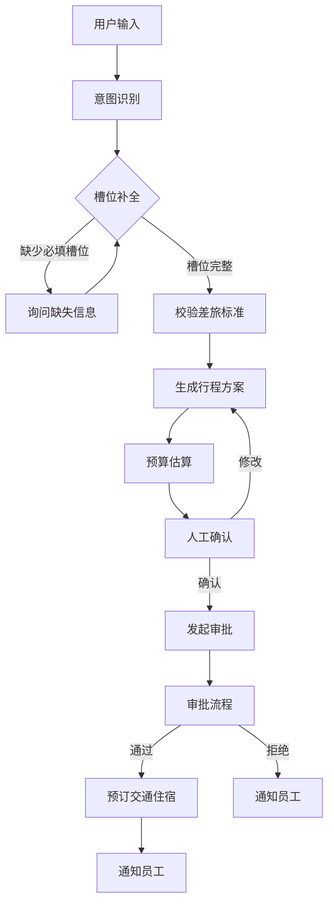

# REQ-08 差旅申请

## 1. 场景概述
员工申请出差，系统按标准生成行程并辅助预订。典型触发语句：
- "下月去上海出差三天"
- "申请去北京出差"

## 2. 用户角色
- **员工**：发起差旅申请
- **主管**：审批差旅申请
- **行政**：协助预订交通与住宿

## 3. 意图槽位
- **意图**: `travel_request`
- **必填槽位**:
  - `destination`: 目的地
  - `start_date`: 出发日期
  - `end_date`: 返回日期
  - `purpose`: 出差目的
- **选填槽位**:
  - `transport`: 交通方式偏好
  - `hotel`: 住宿偏好
  - `budget`: 预算
  - `companions`: 同行人

## 4. 业务流程


## 5. 业务规则
1. **交通标准**：
   - 普通员工：高铁二等座/经济舱
   - 总监及以上：高铁一等座/商务舱
2. **住宿标准**：
   - 一线城市（北上广深）：≤500元/晚
   - 二线城市：≤400元/晚
3. **审批权限**：
   - 出差天数 > 5天需总监审批
4. **申请限制**：
   - 同一目的地30天内不能重复申请
5. **预算控制**：
   - 预算需在部门预算范围内
6. **确认流程**：
   - 生成的行程方案需员工确认后才提交审批

## 6. 风险等级
**高风险** - 涉及资金支出，需人工确认环节

## 7. 工具调用
```json
{
  "tools": [
    {
      "name": "travel_tool.check_standard",
      "description": "查询差旅标准",
      "parameters": ["employee_level", "destination"]
    },
    {
      "name": "travel_tool.generate_itinerary",
      "description": "生成行程方案",
      "parameters": ["destination", "start_date", "end_date", "transport_preference", "hotel_preference"]
    },
    {
      "name": "travel_tool.estimate_budget",
      "description": "预算估算",
      "parameters": ["itinerary", "employee_level"]
    },
    {
      "name": "booking_tool.search_transport",
      "description": "查询交通",
      "parameters": ["origin", "destination", "date", "transport_type"]
    },
    {
      "name": "booking_tool.search_hotel",
      "description": "查询住宿",
      "parameters": ["city", "check_in", "check_out", "budget_limit"]
    },
    {
      "name": "approval_tool.create_approval",
      "description": "发起审批",
      "parameters": ["applicant", "itinerary", "budget", "approvers"]
    }
  ]
}
```

## 8. 异常处理
1. **超标准**：
   - 提示超出标准部分，要求员工确认差价自付或调整方案
2. **预算不足**：
   - 通知员工预算不足，建议调整行程或申请特批
3. **无可用航班/酒店**：
   - 提供替代方案（不同时间、不同交通方式）
4. **重复申请**：
   - 提示30天内已有相同目的地申请，拒绝创建

## 9. 审计要求
1. 记录所有差旅申请的完整生命周期
2. 保存行程方案、预算估算、审批记录
3. 记录预订确认信息（航班号、酒店订单号）
4. 保留员工确认凭证
5. 审计日志需包含操作时间、操作人、操作内容

## 10. 测试用例
### 10.1 正常流程
- **输入**："申请去上海出差三天，下周一到周三"
- **预期**：识别意图，补全槽位，生成行程方案，预算估算，人工确认后提交审批

### 10.2 缺少必填信息
- **输入**："我要出差"
- **预期**：询问目的地、时间等必填信息

### 10.3 超标准申请
- **输入**：普通员工申请一等座
- **预期**：提示标准不符，提供二等座方案，询问是否自付差价

### 10.4 重复申请
- **输入**：30天内再次申请同一目的地
- **预期**：提示重复申请，拒绝创建

### 10.5 预算超限
- **输入**：预算超出部门剩余预算
- **预期**：提示预算不足，建议调整或特批

### 10.6 审批拒绝
- **场景**：主管审批拒绝
- **预期**：通知员工拒绝原因，结束流程

### 10.7 长期出差
- **输入**：出差天数6天
- **预期**：自动升级至总监审批流程