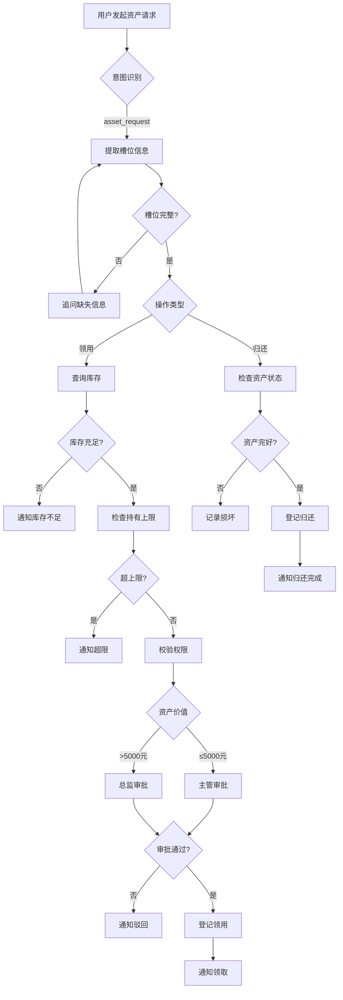

# REQ-09 固定资产领用/归还

> **文档定位（2026-10-06）**：本文件描述产品/场景/架构设计，包含目标能力与示例，不作为当前实现或上线验收证明。实现及验证范围以 [当前状态](../guides/当前状态.md) 为准，后续任务以 [开发计划](../planning/开发计划.md) 为准。原有版本和修订记录用于追溯。

## 1. 场景概述
企业行政AI系统中的固定资产领用与归还管理场景。员工可通过AI助手申请领用或归还固定资产，系统自动完成库存查询、权限校验、审批流程和登记通知。

## 2. 角色权限
- **申请人**: 企业正式员工，可发起资产领用/归还申请
- **直属主管**: 审批一般资产领用申请
- **总监**: 审批贵重资产（价值>5000元）领用申请
- **资产管理员**: 负责资产发放、回收及状态检查
- **系统管理员**: 维护资产库存和配置规则

## 3. 意图槽位
- **意图**: `asset_request`
- **必填槽位**:
  - `asset_name`: 资产名称（如"笔记本电脑"、"显示器"）
  - `action`: 操作类型（领用/归还）
  - `quantity`: 数量
- **可选槽位**:
  - `reason`: 用途说明
  - `expected_return_date`: 预计归还日期（仅领用时需要）

## 4. 业务流程

## 5. 业务规则
1. **库存检查**: 领用前必须检查库存是否充足
2. **持有上限**: 每人同时持有同类资产有上限（如显示器1台）
3. **贵重资产审批**: 单项资产价值超过5000元需总监审批
   > **实现状态（2026-09-20 Batch 14）**：✅ **已实现**。资产已纳入审批清单，按单项价值分级：
   > 价值 ≥5000 元 → 总监（上级部门主管）；≤5000 元或**价值未知** → 主管（兜底规则）。
   > 价值来源：用户表述的金额槽位或资产系统返回；接入资产台账后可自动带出价值。
4. **资产状态检查**: 归还时需检查资产是否完好
5. **归还期限**: 有预计归还日期的资产需按时归还
6. **一人一物**: 同一资产不能同时被多人持有

## 6. 风险等级
**中等风险** - 需要审批流程，涉及资产安全和财务管理

## 7. 工具调用
1. `asset_tool.check_stock`: 检查资产库存
2. `asset_tool.check_limit`: 检查个人持有上限
3. `asset_tool.register`: 登记领用/归还记录
4. `approval_tool.create_approval`: 创建审批流程

## 8. 异常处理
1. **库存不足**: 通知申请人库存情况，建议选择其他资产或等待
2. **超持有上限**: 提醒申请人已达到持有上限，需先归还同类资产
3. **资产损坏**: 记录损坏情况，评估赔偿责任
4. **审批驳回**: 通知申请人审批结果和驳回原因
5. **归还逾期**: 发送提醒通知，记录逾期情况

## 9. 审计要求
1. 所有领用/归还操作必须记录完整日志
2. 审批流程必须留痕，包括审批人、时间、意见
3. 资产状态变更必须拍照存档（特别是贵重资产）
4. 定期生成资产使用报表
5. 异常情况必须人工复核并记录处理结果

## 10. 测试用例
1. **正常领用流程**: 员工申请领用1台显示器，库存充足，主管审批通过
2. **贵重资产领用**: 申请领用价值8000元的笔记本电脑，触发总监审批
3. **库存不足**: 申请领用已无库存的资产，系统正确提示
4. **超限申请**: 员工已持有1台显示器，再次申请时被拒绝
5. **正常归还**: 员工归还完好资产，系统登记成功
6. **损坏归还**: 归还时发现资产损坏，记录损坏情况
7. **审批驳回**: 主管驳回资产领用申请
8. **归还逾期**: 超过预计归还日期未归还，系统发送提醒
