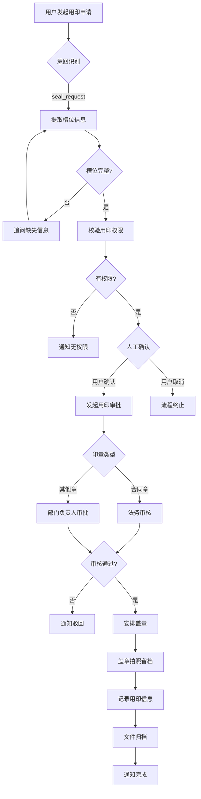

# REQ-10 用印/盖章

## 1. 场景概述
企业行政AI系统中的用印盖章管理场景。涉及公章、合同章、财务章、法人章等各类印章的使用申请和审批流程，确保用印合规、安全、可追溯。

## 2. 角色权限
- **申请人**: 需要盖章的业务经办人
- **部门负责人**: 审批本部门用印申请
- **法务专员**: 审核合同类用印申请
- **印章管理员**: 负责实际盖章操作和记录
- **档案管理员**: 负责盖章文件的归档管理
- **风控专员**: 监督用印合规性

## 3. 意图槽位
- **意图**: `seal_request`
- **必填槽位**:
  - `document_name`: 文件名称
  - `seal_type`: 印章类型（公章/合同章/财务章/法人章）
  - `copies`: 盖章份数
- **可选槽位**:
  - `related_contract_id`: 关联合同编号
  - `urgency`: 紧急程度（普通/紧急）
  - `notes`: 备注说明

## 4. 业务流程

## 5. 业务规则
1. **人工确认强制**: 所有用印申请必须经过申请人人工确认
2. **法务审核**: 合同章使用必须经过法务专员审核
   > **实现状态（2026-09-20）**：**审批链已通，但分支未实现**。用印属高风险业务，已按
   > `approval_rules` 生成审批链（默认规则：部门主管单级，见迁移 `002`）；但合同章要求的
   > 「法务审核」表达不了——规则匹配维度只有「业务类型 + 金额」，无法按印章类型分支。
   > 补齐需要扩展匹配维度并在规则中配置 `role:legal` 审批人（角色类审批人解析已支持）。
3. **拍照留档**: 每次盖章必须拍照存档，确保可追溯
4. **永久保存**: 用印记录必须永久保存，不得删除
5. **权限控制**: 不同印章类型有不同的权限要求
6. **紧急处理**: 紧急用印可走加急流程，但必须补全手续
7. **用印登记**: 每次用印必须详细登记使用情况

## 6. 风险等级
**高风险** - 具有法律效力，必须人工确认，涉及企业法律责任

## 7. 工具调用
1. `seal_tool.check_permission`: 检查用印权限
2. `seal_tool.create_request`: 创建用印申请单
3. `approval_tool.create_approval`: 创建审批流程

## 8. 异常处理
1. **无权限**: 通知申请人无相应印章使用权限
2. **文件不合规**: 法务审核发现文件问题，退回修改
3. **审批驳回**: 审批人驳回申请，通知原因
4. **盖章错误**: 盖章位置或数量错误，需重新申请
5. **印章故障**: 印章损坏或无法使用，安排维修或更换
6. **紧急中断**: 盖章过程中出现问题，暂停流程并上报

## 9. 审计要求
1. 所有用印申请必须保留完整审批记录
2. 盖章照片必须清晰可辨，永久保存
3. 用印记录必须包含：申请人、时间、文件名称、印章类型、审批人
4. 定期审计用印合规性，特别是合同类用印
5. 异常用印必须立即上报并调查
6. 印章使用频率统计，发现异常使用模式

## 10. 测试用例
1. **正常用印**: 申请盖公章2份，部门审批通过，盖章完成
2. **合同章用印**: 申请合同章，必须经过法务审核
3. **无权限申请**: 无权限用户申请用印，系统拒绝
4. **人工确认**: 系统提示确认，用户确认后继续，取消则终止
5. **文件不合规**: 法务审核发现合同条款问题，退回修改
6. **紧急用印**: 紧急申请走加急流程，事后补全手续
7. **盖章记录**: 检查盖章照片和记录是否完整
8. **审批驳回**: 部门负责人驳回用印申请
9. **归档检查**: 验证文件是否正确归档
10. **审计追踪**: 模拟审计，检查记录完整性和可追溯性