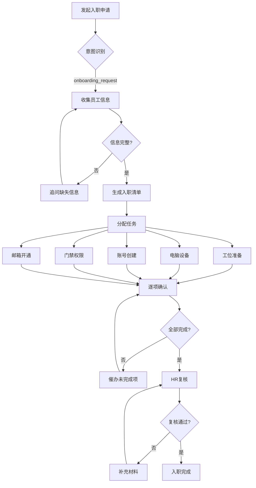
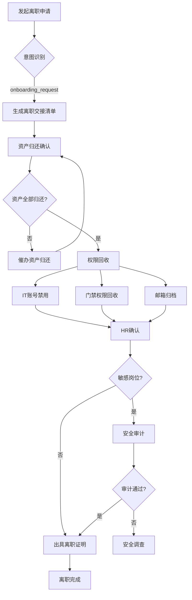

# 入离职办理场景

## 场景概述
企业行政AI系统中的员工入离职办理场景。涵盖新员工入职手续办理和离职员工交接流程，确保入职流程高效规范，离职交接完整安全。

## 角色权限
- **发起人**: HR或部门负责人发起入职/离职流程
- **新入职员工**: 配合完成入职手续
- **离职员工**: 配合完成离职交接
- **直属上级**: 审批入职申请，监督离职交接
- **IT管理员**: 负责账号创建和权限回收
- **资产管理员**: 负责资产发放和归还确认
- **HR专员**: 负责入职培训和离职手续
- **安全专员**: 敏感岗位安全审计

## 意图槽位
- **意图**: `onboarding_request`
- **必填槽位**:
  - `employee_name`: 员工姓名
  - `action`: 操作类型（入职/离职）
  - `date`: 日期（入职日期/离职日期）
- **可选槽位**:
  - `department`: 所属部门
  - `position`: 职位
  - `manager`: 直属上级
  - `handover_checklist`: 交接清单（离职时使用）

## 业务流程

### 入职流程

### 离职流程

## 业务规则
1. **提前申请**: 入职需提前3个工作日申请，离职需提前30天申请
2. **资产归还**: 离职前必须完成所有资产归还确认
3. **权限回收**: 离职前必须回收所有系统权限和物理权限
4. **敏感岗位审计**: 涉及敏感岗位（财务、IT、高管等）需安全审计
5. **交接完整**: 离职交接必须包含工作、文档、资产等各方面
6. **HR复核**: 入职和离职流程都需要HR最终复核
7. **时间限制**: 入职日期不能早于申请日期，离职日期需符合劳动法规定

## 风险等级
**高风险** - 涉及人员变动、资产安全、权限管理，需要分步引导和人工复核

## 工具调用
1. `hr_tool.create_onboarding`: 创建入职流程
2. `hr_tool.create_offboarding`: 创建离职流程
3. `asset_tool.check_return`: 检查资产归还状态
4. `it_tool.revoke_access`: 回收系统权限

## 异常处理
1. **信息不全**: 员工信息不完整，无法继续流程
2. **交接未完成**: 离职交接项目未全部完成，延迟离职
3. **资产未归还**: 有资产未归还，需催办或启动赔偿流程
4. **权限回收失败**: 某些系统权限无法自动回收，需人工处理
5. **安全审计问题**: 审计发现安全隐患，需进一步调查
6. **超时未办理**: 入职/离职手续超时未完成，发送提醒
7. **紧急离职**: 特殊情况需紧急处理离职手续

## 审计要求
1. 入职流程必须记录每个环节的完成时间和责任人
2. 离职交接必须保留完整的交接记录和签字确认
3. 权限回收必须有IT部门的确认记录
4. 资产归还必须有资产管理员的确认记录
5. 敏感岗位审计报告必须存档保存
6. 离职证明必须按规定格式出具并存档
7. 所有流程变更必须记录原因和审批人

## 测试用例
1. **正常入职**: 新员工入职，所有手续按时完成，HR复核通过
2. **信息不全**: 入职信息缺少部门和职位，系统提示补充
3. **入职超时**: 某个环节超时未完成，系统发送催办通知
4. **正常离职**: 员工离职，资产归还、权限回收全部完成
5. **资产未归还**: 离职时发现资产未归还，流程暂停
6. **敏感岗位离职**: IT管理员离职，触发安全审计
7. **紧急离职**: 员工紧急离职，走加急流程
8. **交接不完整**: 工作交接不完整，延迟离职日期
9. **权限回收失败**: 某个系统权限无法自动回收，需人工处理
10. **离职证明**: 检查离职证明格式和内容是否符合要求
11. **流程追溯**: 模拟审计，检查所有记录的完整性和可追溯性