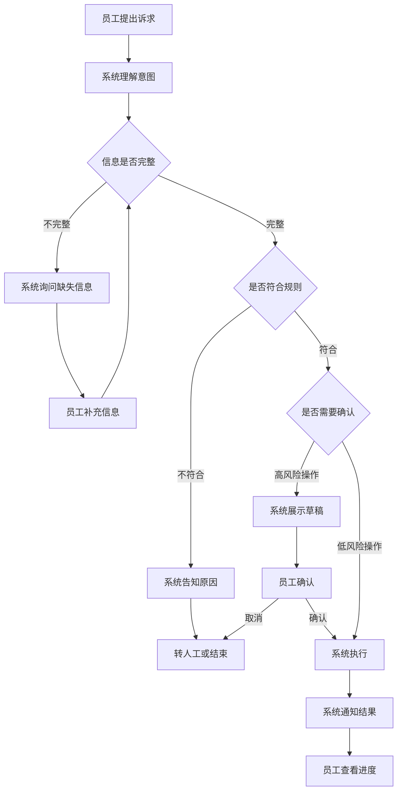
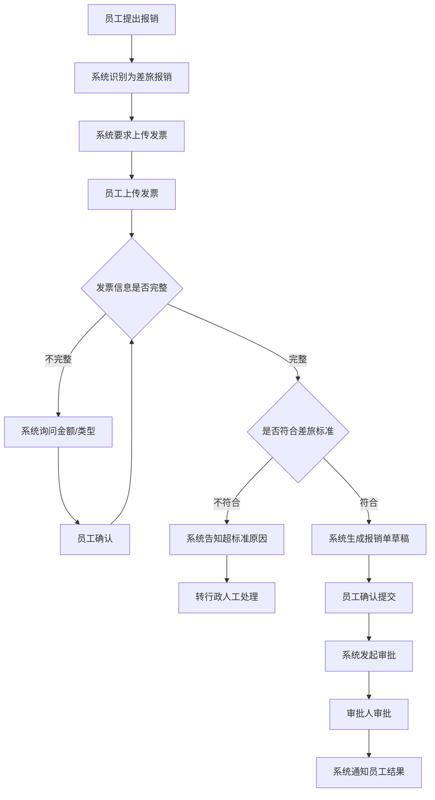
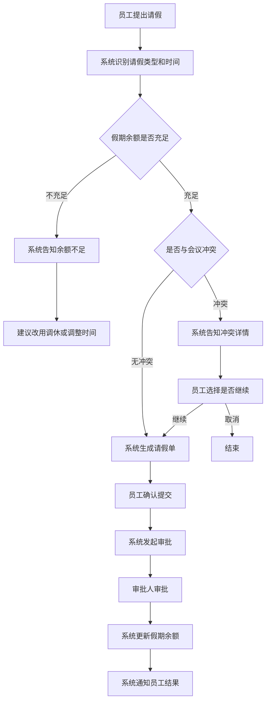
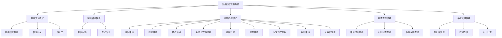

# 企业行政智能系统 需求文档

> 版本：V1.2　|　更新日期：2026-09-16　|　文档类型：产品需求文档（PRD）

---

## 目录

1. [产品概述](#1-产品概述)
2. [范围与边界](#2-范围与边界)
3. [用户角色](#3-用户角色)
4. [用户业务流程](#4-用户业务流程)
5. [功能模块与功能点](#5-功能模块与功能点)
6. [非功能要求与验收要求](#6-非功能要求与验收要求)
7. [系统限制与风险](#7-系统限制与风险)
8. [演进路线](#8-演进路线)

---

## 1. 产品概述

### 1.1 目标用户

企业内部全体员工、部门主管、行政专员、财务/HR 人员、系统管理员。

### 1.2 产品用途

员工通过自然语言提出行政诉求，系统自动理解意图并完成事务办理，包括：制度咨询、资源预定、请假报销、物资领用、证明开具等高频行政事务。

### 1.3 核心价值

| 价值 | 说明 |
|------|------|
| 提效 | 高频事务自助办理，员工无需反复询问行政人员 |
| 规范 | 统一制度口径，避免"每个人答案不一样" |
| 透明 | 全流程状态可查、进度可推送，降低催办成本 |
| 可审计 | 每次操作全程留痕，满足合规要求 |

### 1.4 痛点与解决方式

| 痛点 | 现状 | 系统解决方式 |
|------|------|--------------|
| 重复咨询 | 同类问题被反复询问 | 统一知识库即时回答 |
| 流程繁琐 | 多环节串联，员工无从下手 | 一句话发起，系统自动串联 |
| 规则分散 | 制度散落各处 | 统一入口查询 |
| 信息不对称 | 不知道办到哪了 | 实时状态查询与推送 |
| 人力错配 | 行政忙于机械事务 | 自动化释放人力 |

---

## 2. 范围与边界

### 2.1 系统提供的能力

| 能力类别 | 具体内容 |
|----------|----------|
| 制度咨询 | 回答年假天数、报销标准、请假流程等高频问题 |
| 事务办理 | 请假、报销、物资领用、会议室预定等行政事务 |
| 状态查询 | 查询申请进度、审批状态、办理结果 |
| 异常兜底 | 无法自动处理时转人工或创建工单 |

### 2.2 前置条件

- 员工需通过企业身份认证登录系统
- 系统需对接现有 OA、审批流、物资库等外部系统
- 制度知识库需提前录入并保持更新

### 2.3 不在范围内

- 涉及资金支付、合同签署等高风险操作：系统生成草稿，人工确认后执行
- 超出行政范畴的开放式诉求（如战略咨询）：系统明确告知并引导至相关部门
- 无接口、无数据的系统对接：系统告知限制并提供替代方案

---

## 3. 用户角色

| 角色 | 核心诉求 | 可执行操作 |
|------|----------|------------|
| 普通员工 | 快速办理行政事务 | 发起咨询/申请、查看进度、上传附件 |
| 部门主管 | 审批下属申请 | 接收审批任务、同意/驳回/加签 |
| 行政专员 | 处理例外事务 | 处理转人工工单、维护制度知识库 |
| 财务/HR | 审核专业单据 | 对报销、人事事项做专业复核 |
| 系统管理员 | 管理系统配置 | 配置工具、权限、规则参数、查看审计日志 |

---

## 4. 用户业务流程

### 4.1 通用办事流程

员工办理行政事务的通用流程如下：

**流程说明：**

| 步骤 | 员工动作 | 系统响应 |
|------|----------|----------|
| 提出诉求 | 用自然语言描述需求 | 理解意图，识别办理类型 |
| 补充信息 | 根据提示提供必要信息 | 校验信息完整性 |
| 规则校验 | 无需操作 | 检查是否符合制度和权限 |
| 确认操作 | 查看草稿并确认 | 高风险操作需人工确认 |
| 执行办理 | 无需操作 | 调用相关系统完成办理 |
| 结果通知 | 查看通知 | 推送办理结果和进度 |

### 4.2 报销办事流程

### 4.3 请假办事流程

---

## 5. 功能模块与功能点

### 5.1 功能模块总览

### 5.2 对话交互模块

| 功能点 | 功能描述 | 输入 | 输出 |
|--------|----------|------|------|
| 自然语言对话 | 员工用日常语言描述需求，系统理解意图并响应 | 员工输入的文字消息 | 系统的回复内容或操作引导 |
| 信息补全 | 办理事务所需信息不完整时，系统逐项询问 | 系统提出的问题 | 员工补充的信息 |
| 转人工 | 系统无法处理时，将对话转给人工客服 | 员工确认转人工 | 转接成功提示和工单号 |

### 5.3 制度咨询模块

| 功能点 | 功能描述 | 输入 | 输出 |
|--------|----------|------|------|
| 制度问答 | 回答关于年假、报销标准、请假流程等制度问题 | 员工的制度相关问题 | 制度内容及来源引用 |
| 流程指引 | 说明某类事务的办理步骤和所需材料 | 员工询问如何办理某事 | 办理步骤、所需材料清单 |

### 5.4 事务办理模块

#### 5.4.1 请假申请

| 功能点 | 功能描述 | 输入 | 输出 |
|--------|----------|------|------|
| 发起请假 | 员工通过对话发起请假申请 | 请假类型、开始时间、结束时间 | 请假单草稿 |
| 余额校验 | 系统检查假期余额是否充足 | 请假类型和天数 | 余额是否充足的结果 |
| 冲突检测 | 系统检查是否与会议或项目冲突 | 请假时间段 | 冲突详情或无冲突结果 |
| 发起审批 | 确认后自动发起审批流程 | 员工确认提交 | 审批单号和预计审批时间 |

#### 5.4.2 报销申请

| 功能点 | 功能描述 | 输入 | 输出 |
|--------|----------|------|------|
| 发起报销 | 员工通过对话发起报销申请 | 报销类型、关联出差单 | 报销引导 |
| 发票上传 | 上传发票附件 | 发票图片或PDF | 发票识别结果 |
| 标准校验 | 系统检查是否符合差旅标准 | 发票金额、报销类型 | 是否符合标准的结果 |
| 人工确认 | 高风险操作需员工确认 | 报销单草稿 | 确认或取消 |

#### 5.4.3 物资领用

| 功能点 | 功能描述 | 输入 | 输出 |
|--------|----------|------|------|
| 发起领用 | 员工申请领用办公物资 | 物资名称、数量 | 库存查询结果 |
| 库存检查 | 系统检查库存是否充足 | 物资名称和数量 | 库存状态 |
| 领用确认 | 确认领用信息 | 员工确认 | 领用单号 |

#### 5.4.4 会议室/车辆预定

| 功能点 | 功能描述 | 输入 | 输出 |
|--------|----------|------|------|
| 会议室预定 | 预定指定时间段的会议室 | 日期、时间、人数、设备需求 | 可用会议室列表和预定结果 |
| 车辆预定 | 预定公务用车 | 日期、时间、目的地、人数 | 可用车辆和预定结果 |

#### 5.4.5 证明开具

| 功能点 | 功能描述 | 输入 | 输出 |
|--------|----------|------|------|
| 在职证明 | 申请开具在职证明 | 用途说明 | 证明文件预览和下载 |
| 收入证明 | 申请开具收入证明 | 用途说明 | 证明文件预览和下载 |

#### 5.4.6 差旅申请

| 功能点 | 功能描述 | 输入 | 输出 |
|--------|----------|------|------|
| 发起差旅 | 申请出差并预订交通住宿 | 目的地、时间、事由 | 差旅单草稿和行程建议 |
| 行程预订 | 按标准预订机票/酒店 | 确认行程 | 预订确认信息 |

#### 5.4.7 固定资产领用

| 功能点 | 功能描述 | 输入 | 输出 |
|--------|----------|------|------|
| 资产领用 | 申请领用固定资产 | 资产类型、数量 | 可用资产查询结果 |
| 资产归还 | 申请归还已领用资产 | 资产编号 | 归还确认 |

#### 5.4.8 用印申请

| 功能点 | 功能描述 | 输入 | 输出 |
|--------|----------|------|------|
| 发起用印 | 申请使用公章/合同章 | 文件名称、用印类型、份数 | 用印申请单草稿 |
| 人工确认 | 用印操作需人工确认 | 用印申请详情 | 确认后发起审批 |

#### 5.4.9 入离职办理

| 功能点 | 功能描述 | 输入 | 输出 |
|--------|----------|------|------|
| 入职引导 | 引导新员工完成入职手续 | 员工信息 | 待办事项清单和办理指引 |
| 离职引导 | 引导离职员工完成交接 | 离职申请 | 交接事项清单和办理指引 |

### 5.5 状态查询模块

| 功能点 | 功能描述 | 输入 | 输出 |
|--------|----------|------|------|
| 申请进度查询 | 查询某项申请的当前状态 | 申请单号或描述 | 当前状态、审批节点、预计完成时间 |
| 审批状态查询 | 查询待审批或已审批的列表 | 无 | 待办审批列表和历史审批记录 |
| 假期余额查询 | 查询各类假期的剩余天数 | 假期类型 | 当前可用余额 |

### 5.6 系统管理模块

| 功能点 | 功能描述 | 输入 | 输出 |
|--------|----------|------|------|
| 知识库管理 | 上传、编辑、删除制度文档 | 文档内容或文件 | 操作结果 |
| 权限配置 | 配置角色和功能权限 | 角色、权限范围 | 配置结果 |
| 审计日志 | 查看系统操作记录 | 查询条件 | 操作记录列表 |

---

## 6. 非功能要求与验收要求

### 6.1 性能要求

| 指标 | 目标值 | 验收方式 |
|------|--------|----------|
| 首次响应时间 | ≤ 3 秒 | 压力测试 |
| 复杂任务处理时间 | ≤ 10 秒 | 端到端测试 |
| 并发用户数 | ≥ 100 | 压力测试 |

### 6.2 可用性要求

| 指标 | 目标值 | 验收方式 |
|------|--------|----------|
| 系统可用性 | ≥ 99.5% | 监控统计 |
| 故障降级 | 自动转人工 | 异常场景测试 |

### 6.3 质量要求

| 指标 | 目标值 | 验收方式 |
|------|--------|----------|
| 意图识别准确率 | ≥ 92% | 黄金测试集评测 |
| 端到端任务完成率 | ≥ 85% | 集成测试 |
| 信息补全轮次 | ≤ 2 次 | 测试统计 |
| 转人工率 | ≤ 20% | 运营数据 |
| 规则校验准确率 | ≥ 98% | 单元测试 |
| 审计覆盖率 | 100% | 审计日志检查 |

### 6.4 安全要求

| 要求 | 说明 |
|------|------|
| 身份认证 | 支持企业 SSO 登录 |
| 权限隔离 | 按角色控制功能访问范围 |
| 数据脱敏 | 敏感信息日志脱敏 |
| 操作审计 | 全量操作记录可追溯 |
| 高风险确认 | 资金、合同等操作需人工确认 |

### 6.5 可观测性要求

| 要求 | 说明 |
|------|------|
| 调用日志 | 记录每次对话的输入、输出、耗时 |
| 成本统计 | LLM Token 消耗按模型维度统计 |
| 业务指标 | 对话数、任务数、转人工率、满意度 |

---

## 7. 系统限制与风险

### 7.1 准确性限制

系统依赖大语言模型理解意图，可能出现误解或信息抽取错误。缓解方式：高风险操作需人工确认，低置信度自动转人工。

### 7.2 规则覆盖限制

行政事务存在大量例外和灵活处理，规则无法完全穷举。缓解方式：例外情况转人工处理，并将处理结果沉淀为规则。

### 7.3 系统集成限制

部分老旧系统接口不规范或无接口。缓解方式：通过适配层封装，无法对接的场景转人工处理。

### 7.4 数据准确性限制

系统依赖的库存、假期余额等数据可能不准确。缓解方式：关键数据实时查询上游系统，数据异常时降级为人工。

---

## 8. 演进路线

### 第一阶段：标准高频场景（第 1-8 周）

覆盖场景：制度问答、会议室/车辆预定、综合查询、请假申请

目标：跑通核心流程，验证准确率和用户满意度

### 第二阶段：复杂流程场景（第 5-16 周）

覆盖场景：报销、差旅、物资领用、证明开具

目标：引入人工确认机制，完善审批流对接和审计

### 第三阶段：跨系统场景（第 11 周+）

覆盖场景：入离职、用印/合同、固定资产

目标：多系统协同，形成可复制的中台能力

---

## 附录 A：术语

| 术语 | 说明 |
| --- | --- |
| 智能体 | 系统中能理解用户意图并自动办理事务的核心组件 |
| 多轮对话 | 系统与用户多次交互以补全信息的过程 |
| 转人工 | 系统无法处理时，将对话转给人工客服 |
| 审批流 | 申请需经相关人员审核批准的流程 |
| 知识库 | 存储制度、规则、FAQ 等文档的数据库 |

## 附录 B：需求追溯矩阵

为便于验收与测试对齐，为每个业务场景分配需求编号；测试用例编号规则为 `TC-<REQ编号>-<序号>`，与 [测试计划](guides/测试计划.md) 对应。

| 需求编号 | 场景 | 功能模块 | 主要验收指标 |
|----------|------|----------|--------------|
| REQ-01 | 制度问答 | 制度咨询模块 | 意图准确率 ≥92% |
| REQ-02 | 会议室 / 车辆预定 | 事务办理模块 | 端到端完成率 ≥85% |
| REQ-03 | 综合查询 | 状态查询模块 | 状态查询准确率 ≥98% |
| REQ-04 | 物资领用 | 事务办理模块 | 规则校验准确率 ≥98% |
| REQ-05 | 请假申请 | 事务办理模块 | 端到端完成率 ≥85% |
| REQ-06 | 证明开具 | 事务办理模块 | 端到端完成率 ≥85% |
| REQ-07 | 报销申请 | 事务办理模块 | 规则校验准确率 ≥98% |
| REQ-08 | 差旅申请 / 订票 | 事务办理模块 | 端到端完成率 ≥85% |
| REQ-09 | 固定资产领用 / 归还 | 事务办理模块 | 端到端完成率 ≥85% |
| REQ-10 | 用印 / 盖章 / 合同 | 事务办理模块 | 审计覆盖率 100% |
| REQ-11 | 入离职办理 | 事务办理模块 | 端到端完成率 ≥85% |

## 附录 C：文档修订记录

| 版本 | 日期 | 修订内容 |
|------|------|----------|
| V1.0 | 2026-08-27 | 初稿 |
| V1.1 | 2026-09-15 | 统一场景与意图口径；新增需求追溯矩阵；移除论证性表述 |
| V1.2 | 2026-09-16 | 按需求文档规范重构；分离技术方案至设计文档；新增功能模块与功能点；优化语言风格 |
