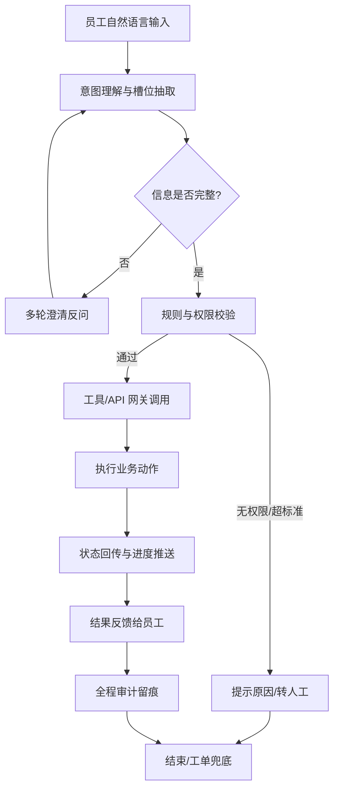
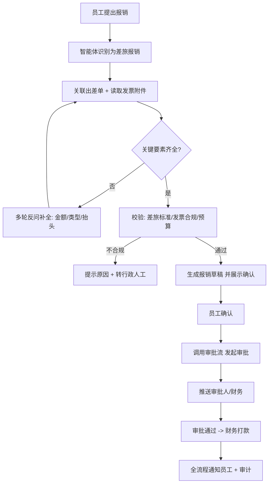
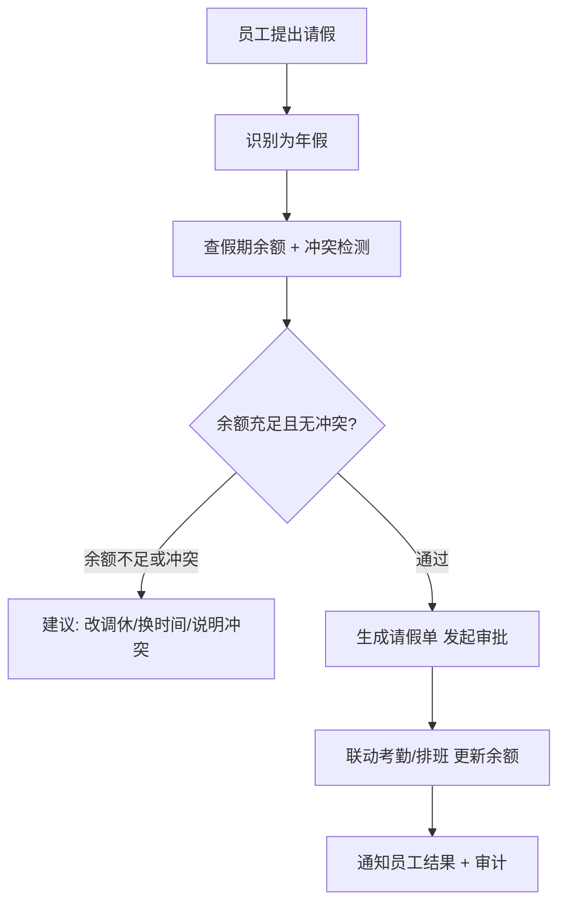
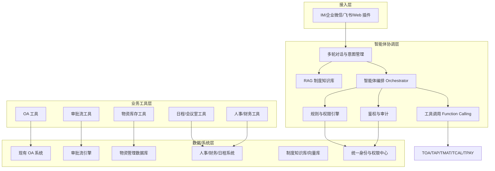

# 企业行政智能系统 需求文档

> 版本：V1.1　|　更新日期：2026-09-15　|　文档类型：产品需求文档（PRD）

---

## 目录

1. [项目背景与定位](#1-项目背景与定位)
2. [用户角色与场景分析](#2-用户角色与场景分析)
3. [核心业务流程图](#3-核心业务流程图)
4. [技术方案与架构](#4-技术方案与架构)
5. [原型图页面设计](#5-原型图页面设计)
6. [系统短板与潜在风险](#6-系统短板与潜在风险)
7. [验收标准与衡量指标](#7-验收标准与衡量指标)
8. [演进路线](#8-演进路线)

---

## 1. 项目背景与定位

### 1.1 背景与痛点

企业内部行政事务具有**高频、琐碎、规则性强但流程繁琐**的特点，长期依赖人力处理，存在以下典型问题：

| 痛点 | 具体表现 |
| --- | --- |
| 重复劳动 | 同一类问题（报销怎么填、请假几天、A4纸怎么领）被员工反复询问，行政人员被大量低价值咨询占用 |
| 流程链路长 | 一个简单事务往往要经过「询问规则 → 找表单 → 填资料 → 找审批 → 等结果」多个环节，员工无从下手 |
| 规则分散 | 制度散落在文档、群聊、口头经验中，缺乏统一入口，员工与行政理解不一致 |
| 信息不对称 | 员工不知道"能不能办、怎么办、办到哪了"，催办与进度查询成本高 |
| 资源错配 | 行政人力投入到机械性事务，无法聚焦于更有价值的服务与管理决策 |

### 1.2 产品定位

**企业行政智能系统** 是一套面向企业内部员工的 **AI 行政数字员工 / 智能助理**。员工通过自然语言提出行政诉求，智能体**理解意图 → 结合现有 OA / 审批流 / 物资管理数据库等系统 → 自动或半自动完成事务办理**，支持**多轮对话澄清**与**全流程状态跟踪**。

一句话定位：**"员工动嘴，系统办事"**——把企业内行政事务从"人找事"变成"事找人"。

### 1.3 产品边界（做什么 / 不做什么）

**做：**
- 行政事务的咨询、办理、状态跟进（需求受理与执行）
- 对接现有 OA、审批流、物资库、日程、人事等系统
- 制度、规则的高频问答（知识检索）
- 异常情况转人工、转工单的兜底

**不做（边界声明）：**
- **不替代人的最终决策**：高风险、强合规、涉及资金与法律效力的事务，系统只做"草拟 + 校验 + 提示"，关键节点必须人工确认
- **不改造存量系统核心逻辑**：以网关适配方式集成，避免侵入式改动带来的稳定风险
- **不处理**超出行政范畴、无明确规则的开放式诉求（如战略咨询），需明确"智能体可办 vs 转人工"的边界
- **不承诺**无权限、无数据、无接口的场景能"硬办"，而是明确拒绝并给出指引

### 1.4 建设目标

- **提效**：高频事务自助化，减少行政人力在机械咨询上的投入
- **规范**：统一制度入口与办理口径，减少"每个人答案不一样"
- **透明**：全流程留痕、状态可查、进度可推送，降低催办成本
- **可审计**：每一次智能体动作都在授权范围内执行，且全程可追溯

---

## 2. 用户角色与场景分析

### 2.1 用户角色

| 角色 | 核心诉求 | 使用边界 |
| --- | --- | --- |
| 普通员工 | 快速把事情办成，少问多自助 | 发起咨询/申请，查看进度 |
| 部门主管 | 审批、把控合规与成本 | 接收审批任务，可同意/驳回/加签 |
| 行政专员 | 从繁琐重复中解放，处理例外 | 处理智能体无法自动完成的兜底事务、维护制度 |
| 财务 / HR | 把控合规、审核单据 | 对报销、人事事项做专业复核 |
| 系统管理员 | 管理工具、权限、审计 | 配置可调用工具、权限范围、规则参数 |

### 2.2 应用场景矩阵（按频次与复杂度）

按 **业务频次（高/低）** 与 **流程复杂度（简单/复杂）** 划分，指导迭代优先级：

| 场景 | 频次 | 复杂度 | 典型诉求描述 | 是否可自动完成 |
| --- | --- | --- | --- | --- |
| 制度问答 | 高 | 简单 | "年假有几天""报销打车上限多少" | ✅ 全自动（RAG 查询） |
| 会议室 / 车辆预定 | 高 | 简单 | "明天下午2点订个能投屏的10人会议室" | ✅ 全自动（查资源+锁定） |
| 物资领用 | 高 | 中 | "领一箱A4纸" | ✅ 自动（查库存/权限+扣减+补货提醒） |
| 请假申请 | 高 | 中 | "下周请两天年假" | ✅ 自动（校验余额/冲突+发起审批） |
| 报销申请 | 中 | 复杂 | "周五出差酒店发票怎么报" | ⚠️ 半自动（草拟+校验+人工确认） |
| 差旅申请/订票 | 中 | 复杂 | "下月去上海出差三天" | ⚠️ 半自动（生成行程+按标准预订） |
| 用印 / 盖章 / 合同 | 低 | 复杂 | "这份合同要盖章" | ⚠️ 半自动（校验+发起审批+人工确认） |
| 证明开具（在职/收入） | 中 | 中 | "开一份在职证明" | ✅ 自动（校验身份+生成+推送盖章） |
| 固定资产领用/归还 | 中 | 中 | "领一台显示器" | ⚠️ 半自动（校验+登记+主管审批） |
| 入离职办理 | 低 | 复杂 | "新同事入职要办什么" | ⚠️ 半自动（引导+分步办理+人工复核） |
| 综合查询 | 高 | 简单 | "我上个月报销到哪一步了" | ✅ 全自动（状态查询） |

> 🔎 **设计洞察**：上表是确定"哪些场景优先做、能否全自动"的核心依据。按风险**分级授权**（见 §4.3）是质量与合规的平衡点。

### 2.3 关键场景详解（选取"报销"与"请假"作为端到端示例）

#### 场景 A：员工报销
- **员工输入**："我周五去杭州出差的酒店发票，怎么报销呀？"
- **智能体行为**：
  1. 识别意图=报销、业务=差旅报销、关联出差申请单
  2. 检查关键要素：是否有出差单据、发票金额、发票类型、抬头
  3. 信息不全 → **多轮反问**："请上传酒店发票，并确认金额是 1280 元吗？"
  4. 校验规则：是否超差旅标准、发票是否合规、预算是否充足
  5. **生成报销单草稿**（字段预填），展示给员工确认
  6. 员工确认 → 调用审批流引擎发起审批 → 推送审批人
  7. 审批进度实时回传，完成后通知员工
- **兜底**：发票无法识别 / 超标准 → 提示原因并可转行政专员人工处理

#### 场景 B：员工请假
- **员工输入**："我下周请两天年假"
- **智能体行为**：
  1. 识别意图=请假、类型=年假、时间=下周某两天
  2. 反查假期余额、是否与重要会议/项目冲突、是否连续节假日
  3. 余额不足 / 冲突 → 给出建议（改调休/换时间/说明冲突）
  4. 校验通过 → 生成请假单 → 发起审批 → 联动考勤/排班
  5. 审批结果通知，更新员工假期余额

---

## 3. 核心业务流程图

### 3.1 通用闭环流程（所有场景的骨架）



**闭环关键节点说明：**

| 环节 | 职责 | 关键设计点 |
| --- | --- | --- |
| 意图理解 | 判断"员工想办什么" | 用 LLM + 意图分类器，输出标准化意图与业务类型 |
| 槽位抽取 | 提取"办这件事需要的信息" | 从对话/附件/已有系统数据中补全字段 |
| 多轮澄清 | 信息不全时反问，避免"猜" | 每次只问一个最关键缺失项，降低交互负担 |
| 权限校验 | 判断"这个人能不能办、能办多少" | 结合组织架构、角色、预算/库存范围 |
| 工具调用 | 真正访问 OA/审批/物资/日程 | 统一网关，鉴权、幂等、限流、降级 |
| 状态回传 | 让员工"知道办到哪了" | 主动推送 + 可主动查询 |
| 审计留痕 | 全操作可追溯 | 记录输入、调用、返回、决策、操作人 |

### 3.2 端到端示例流程：报销



### 3.3 端到端示例流程：请假



---

## 4. 技术方案与架构

### 4.1 总体架构（分层）



### 4.2 关键组件与职责

| 组件 | 职责 | 技术选型说明 |
| --- | --- | --- |
| **LLM 大模型** | 意图理解、槽位抽取、对话生成、异常理解 | 优先**私有化/混合部署**（合规、数据不出域）；对简单意图用轻量模型降本 |
| **意图识别与路由** | 将输入路由到正确意图/工具 | 分类器 + Function Calling（ReAct），多意图可拆分 |
| **多轮对话管理（Dialog）** | 记录对话状态、槽位补全、上下文 | 会话状态持久化，支持中断恢复、多轮澄清 |
| **RAG 知识检索** | 制度/规则/FAQ 召回与引用 | 向量库 + 制度文档切片，回答附**引用来源**，降低幻觉 |
| **工具/API 网关** | 封装 OA/审批/物资/日程等为统一工具 | 接口适配层：鉴权（SSO/OAuth2）、幂等、限流、降级、重试 |
| **规则与权限引擎** | 判断"能不能办、金额/库存边界、规则校验" | 可配置规则（差旅标准、预算、库存阈值）+ 组织角色权限 |
| **鉴权与审计** | 身份校验、操作留痕 | 全量记录"输入→调用→返回→决策→操作人"，可审计可回溯 |
| **异常兜底** | 置信度低/无权限/执行失败处理 | 转人工、创建工单、引导至行政专员 |

### 4.3 技术方案的关键设计决策

**决策 1：自主执行采用「分级授权 + 关键节点人工确认」**

| 风险等级 | 场景示例 | 智能体行为 | 是否人工确认 |
| --- | --- | --- | --- |
| 低 | 制度问答、资源查询、会议室预定 | 全自动执行 | 否 |
| 中 | 物资领用、请假 | 自动执行并留痕 | 否（但可撤回） |
| 高 | 报销打款、用印、合同、预算申请 | 草拟 + 校验 + 提示，提交前必须人工确认 | **是** |

> 该设计是 §6"短板与风险"的核心应对——既体现智能化，又守住合规与责任边界。

**决策 2：存量系统做「网关适配层」**

- 老 OA / 物资库接口不规范、文档缺失、部分无 API → 通过网关适配层统一封装为**标准工具**，屏蔽底层差异
- 无法提供接口的系统 → 通过 RPA / 人工辅助节点兜底，避免强改造存量系统
- 该层同时负责鉴权、幂等、限流、重试，是降低集成风险的关键

**决策 3：安全合规底线**

- 数据脱敏、权限隔离（最小权限原则）
- 敏感操作（打款、用印、导出）二次确认 + 强鉴权
- 全流程审计留痕，满足财务与法务审计要求
- 私有化/混合部署，核心制度与个人信息不出域

### 4.4 非功能需求（NFR）

| 维度 | 指标 |
| --- | --- |
| 性能 | 首响应 < 3s；复杂任务编排 < 10s |
| 可用性 | 关键路径可用性 ≥ 99.5%；智能体故障时降级为人工 |
| 并发 | 支持企业级规模并发对话（弹性伸缩） |
| 安全 | 等保合规、数据加密、权限隔离、全审计 |
| 可扩展 | 新增业务工具/场景可配置接入，不改核心 |
| 可观测 | 调用日志、Token 成本、成功率、满意度、转人工率 |
| 一致性 | 与存量系统状态最终一致，幂等防重复提交 |

---

## 5. 原型图页面设计

> 以下为**关键页面**的 ASCII 线框图（交互低保真）。完整原型建议覆盖：主对话页、信息补全卡片、业务确认卡片、状态跟踪/待办中心、系统管理页。

### 5.1 主对话页（员工端，IM/Web 入口）

```
┌─────────────────────────────────────────────┐
│  行政智能助手                    [ ●●●● ]   │
├─────────────────────────────────────────────┤
│  ▍员工：我周五去杭州出差的酒店发票怎么报销？ │
│                                           │
│  ┌───────────────────────────────────────┐ │
│  │ 💡 智能助手：                          │ │
│  │ 这是一笔【差旅报销】，关联到你的出差单   │ │
│  │ 「ZJ-2026-0088」。请你：                │ │
│  │ ① 上传酒店发票                         │ │
│  │ ② 确认金额是否为 1280 元                │ │
│  │ [上传附件] [确认金额] [修改]            │ │
│  └───────────────────────────────────────┘ │
│                                           │
│  ▍员工：[上传发票.jpg] 1280元，对           │
│  ┌───────────────────────────────────────┐ │
│  │ ✅ 已识别发票，校验通过：                │ │
│  │   - 金额 1280 元（在差旅标准内）        │ │
│  │   - 抬头正确                            │ │
│  │ 下面是报销单草稿，请确认：              │ │
│  │  [ 报销单预览卡片 ]                     │ │
│  │  [ 确认提交 ]   [ 先不办 ]              │ │
│  └───────────────────────────────────────┘ │
├─────────────────────────────────────────────┤
│  [ 输入框 ]                          [发送] │
└─────────────────────────────────────────────┘
```

### 5.2 信息补全卡片（多轮澄清）

```
┌───────────────────────────────────────────┐
│ 🔍 需要补全以下信息                        │
├───────────────────────────────────────────┤
│ 请假类型         ● 年假  ○ 调休  ○ 事假   │
│ 开始时间         [ 2026-09-05 ]            │
│ 结束时间         [ 2026-09-06 ]            │
│ 是否合并节假日   ○ 是  ● 否                │
├───────────────────────────────────────────┤
│            [ 提交 ]  [ 取消 ]              │
└───────────────────────────────────────────┘
```

### 5.3 业务确认卡片（高风险操作，人工确认）

```
┌───────────────────────────────────────────┐
│ ⚠️ 请确认以下操作（将发起盖章审批）        │
├───────────────────────────────────────────┤
│ 合同名称       XX 采购合同                  │
│ 用印类型       公章                         │
│ 用印份数       3 份                         │
│ 关联审批单     AP-2026-1123                 │
│ 重要提示：此操作将产生法律效力，请核对！   │
├───────────────────────────────────────────┤
│              [ 确认发起 ]  [ 取消 ]        │
└───────────────────────────────────────────┘
```

### 5.4 状态跟踪 / 待办中心（员工 + 审批人）

```
┌──────────────────────────────────────────────────┐
│  待办中心                                    [全部]│
├──────────────────────────────────────────────────┤
│ ▶ 报销单 RX-2026-0456        ⏳ 审批中(财务)     │
│   进度：申请 → 部门 → 财务(th 2/3)               │
│ ▶ 请假单 QJ-2026-0089        ⏳ 审批中(主管)     │
│ ▶ 会议室 3F-01                ✅ 已预定 14:00   │
├──────────────────────────────────────────────────┤
│  我的待办审批                                   │
│ ▶ 张三的报销单  ¥1,280.00      [同意][驳回][加签]│
└──────────────────────────────────────────────────┘
```

### 5.5 系统管理页（管理员）

```
┌──────────────────────────────────────────────────┐
│  系统管理                                        │
├──────────────────────────────────────────────────┤
│  工具管理     [OA][审批流][物资][日程][财务]     │
│              └ 新增工具 / 配置参数 / 启用开关    │
│  权限配置     [角色-工具可见范围] [预算额度]     │
│  规则配置     [差旅标准][库存阈值][审批层级]     │
│  审计日志     [全量操作记录][导出] [搜索]        │
│  转人工清单   [待处理工单][指派行政专员]         │
└──────────────────────────────────────────────────┘
```

---

## 6. 系统短板与潜在风险

> 本节**主动、结构性**地暴露系统短板，每条均给出"风险描述 + 缓解策略"。

### 6.1 准确性与幻觉

- **风险**：LLM 可能误解意图、抽取错误槽位，甚至"编造"不存在的审批单/标准，导致错误办理。
- **缓解**：意图/槽位输出做**结构化校验**；回答附 RAG 引用来源；高风险动作前人工确认；建立**准确性回落机制**（置信度低→转人工）。

### 6.2 权限与安全

- **风险**：越权访问（员工查他人单据/预算）、数据泄露、敏感操作被误执行。
- **缓解**：最小权限原则、严格身份鉴权（SSO/OAuth2）、敏感操作**二次确认**、全量审计；私有化部署控数据出域。

### 6.3 存量系统集成复杂度

- **风险**：老 OA/物资库接口不规范、文档缺失、部分无 API；强行对接导致改造成本与稳定性风险。
- **缓解**：网关适配层统一封装；无接口场景用 RPA/人工节点兜底；**不侵入式改造**存量系统。

### 6.4 规则无法穷举与"例外/人情"决策

- **风险**：行政事务大量依赖特批、例外、灵活处理，规则难以完全穷举；纯规则判断僵化，易误拒。
- **缓解**：规则引擎 + **人的决策兜底**（例外走人工）；将"例外"沉淀回规则库形成闭环；设计"智能体建议 + 人裁定"模式。

### 6.5 责任与合规

- **风险**：智能体误执行导致资金/法律损失时责任难界定；审计缺失会被质疑。
- **缓解**：关键节点**留痕 + 人工复核**；明确"智能体辅助、人决策"的责任边界；符合财务/法务审计要求。

### 6.6 数据一致性与状态同步

- **风险**：上游系统（OA/库存/考勤）状态多端变更，智能体获取的可能是过期数据，导致"办了但没更新"或重复提交。
- **缓解**：事件订阅/轮询同步、幂等设计防重复、最终一致性；状态回传以**上游系统为准**。

### 6.7 用户接受度与体验

- **风险**：误判导致反复澄清、交互低效，员工觉得"还不如自己/找人办"。
- **缓解**：一次只问一个关键项；提供**快捷指令/表单兜底**；明确"智能体办不了→一键转人工"的低摩擦路径。

### 6.8 成本与性能

- **风险**：LLM 调用成本随对话量线性增长；高峰并发时延与稳定性压力。
- **缓解**：分级模型（简单意图用轻量模型）、缓存高频问答、批量与降级策略；监控 Token 成本设置告警阈值。

### 6.9 数据质量

- **风险**：物资库存、组织架构、假期余额等基础数据不准确，导致智能体"基于错误数据做正确决策"。
- **缓解**：上线前数据治理与校验；为关键数据建立**准确性检查与告警**；数据异常时降级为人工。

### 6.10 监管与长尾场景

- **风险**：财务/用印/合同等强监管流程合规要求高；低频复杂事务难以覆盖，容易"会办的很好办，不会办的一点不会"。
- **缓解**：定义清晰的**"智能体可办 vs 转人工"边界**；长期用运营数据驱动场景扩充；强监管动作始终保留人工复核与审计。

---

## 7. 验收标准与衡量指标

### 7.1 质量指标（上线前验收）

| 维度 | 目标值 |
| --- | --- |
| 意图识别准确率 | ≥ 92% |
| 端到端任务完成率 | ≥ 85% |
| 多轮澄清平均次数 | ≤ 2 次/单 |
| 转人工率 | ≤ 20%（高频场景） |
| 业务规则校验准确率 | ≥ 98% |
| 审计覆盖率 | 100% |
| 关键路径可用性 | ≥ 99.5% |

### 7.2 业务成效指标（上线后跟踪）

- 行政人工处理量下降比例
- 员工平均处理一件事务耗时下降
- 制度咨询自助解决率
- 审批平均流转时长缩短
- 用户满意度评分（NPS / 好评率）
- 单事务 LLM 成本 / 平均响应时延

---

## 8. 演进路线

**阶段一：标准高频场景（0-3 个月）**
- 制度问答（RAG）、会议室/车辆预定、综合查询
- 目标：跑通"自然语言→工具调用→状态回传"闭环，验证准确率与满意度

**阶段二：复杂流程场景（3-6 个月）**
- 请假、报销、差旅、物资领用、证明开具
- 目标：引入**分级授权 + 关键节点人工确认**，接入审批流引擎与物资库，完善审计

**阶段三：跨系统智能编排（6 个月+）**
- 入离职全流程、用印/合同、固定资产
- 目标：多工具协同编排、智能决策（预算预测、采购补货建议）、沉淀"例外→规则"闭环，形成可复制的中台能力

> 周级排期见 [设计计划与里程碑](guides/设计计划与里程碑.md) §1.3。

---

## 附录 A：术语

| 术语 | 说明 |
| --- | --- |
| 智能体（Agent） | 基于 LLM，能理解意图、调用工具、多轮对话完成任务的系统 |
| 槽位（Slot） | 完成一项业务所需的关键信息字段（如金额、日期、类型） |
| 工具调用（Function Calling） | 智能体调用外部系统 API 执行动作的能力 |
| RAG（检索增强生成） | 从知识库检索制度/规则，辅助 LLM 回答以降低幻觉 |
| 分级授权 | 按风险等级决定全自动 / 自动留痕 / 人工确认的权限策略 |

## 附录 B：关于本方案的关键思考总结

1. **核心不是"接入大模型"，而是"如何安全可控地让大模型操作企业真实业务"** —— 所以重点落在意图理解、多轮澄清、权限校验、审计与异常兜底。
2. **分级授权是质量与合规的平衡点** —— 既满足智能化预期，又守住"责任与监管"的合规底线。
3. **存量系统集成是最大工程风险** —— 用"网关适配层 + RPA兜底"降低改造风险，避免"为了智能而重建系统"。
4. **主动承认边界与短板** —— 能说清楚"什么场景做不了、为什么会出错、如何兜底"，比一味强调"什么都能做"更有说服力。

---

## 附录 C：需求追溯矩阵

为便于验收与测试对齐，为每个业务场景分配需求编号；测试用例编号规则为 `TC-<REQ编号>-<序号>`，与 [测试计划](guides/测试计划.md) 对应。

| 需求编号 | 场景 | 自动化程度 | 意图标签 | 主要验收指标 |
|----------|------|-----------|----------|--------------|
| REQ-01 | 制度问答 | ✅ 全自动 | policy_query | 意图准确率 ≥92%，RAG Hit@5 ≥80% |
| REQ-02 | 会议室 / 车辆预定 | ✅ 全自动 | meeting_room_booking | 端到端完成率 ≥85% |
| REQ-03 | 综合查询 | ✅ 全自动 | status_query | 状态查询准确率 ≥98% |
| REQ-04 | 物资领用 | ✅ 自动 | material_request | 规则校验准确率 ≥98% |
| REQ-05 | 请假申请 | ✅ 自动 | leave_request | 端到端完成率 ≥85% |
| REQ-06 | 证明开具 | ✅ 自动 | certificate_request | 端到端完成率 ≥85% |
| REQ-07 | 报销申请 | ⚠️ 半自动 | expense_request | 规则校验准确率 ≥98% |
| REQ-08 | 差旅申请 / 订票 | ⚠️ 半自动 | travel_request | 端到端完成率 ≥85% |
| REQ-09 | 固定资产领用 / 归还 | ⚠️ 半自动 | asset_request | 端到端完成率 ≥85% |
| REQ-10 | 用印 / 盖章 / 合同 | ⚠️ 半自动 | seal_request | 审计覆盖率 100% |
| REQ-11 | 入离职办理 | ⚠️ 半自动 | onboarding_request | 端到端完成率 ≥85% |

> 意图标签与 [技术方案 §5.2](architecture/行政智能系统-技术方案设计.md) 的 `INTENT_PROMPT` 一致：11 个业务意图 + `greeting` + `other`，共 13 个标签。

## 附录 D：文档修订记录

| 版本 | 日期 | 修订内容 |
|------|------|----------|
| V1.0 | 2026-08-27 | 初稿 |
| V1.1 | 2026-09-15 | 统一场景与意图口径；新增需求追溯矩阵；移除论证性表述 |
